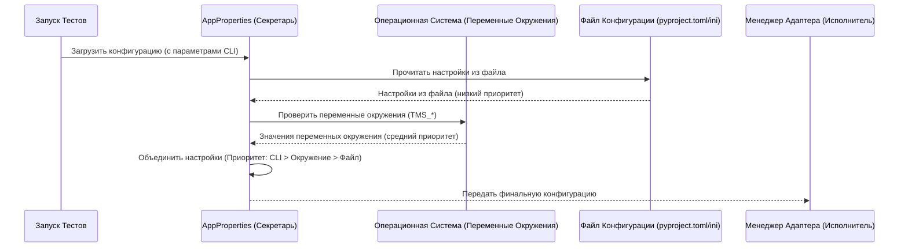

# Chapter 1: Загрузка Конфигурации (AppProperties)


Добро пожаловать в мир адаптеров Test IT для Python! В этом руководстве мы шаг за шагом разберем, как работают эти адаптеры, чтобы вы могли легко интегрировать ваши автотесты с системой управления тестированием Test IT.

Начнем с самого первого и очень важного шага: настройки. Представьте, что вы собираетесь отправить отчет о результатах тестов в Test IT. Чтобы адаптер мог это сделать, ему нужно знать несколько вещей:

1.  **Куда отправлять?** (Адрес вашего сервера Test IT - `url`)
2.  **Кто отправляет?** (Ваш секретный ключ API - `privateToken`)
3.  **В какой проект?** (ID вашего проекта в Test IT - `projectId`)
4.  **Для какой конфигурации тестов?** (ID конфигурации в Test IT - `configurationId`)

Без этой информации адаптер просто не сможет связаться с Test IT. Где же хранить все эти настройки и как адаптер их находит?

Именно эту задачу решает компонент **`AppProperties`**. Он действует как прилежный секретарь, который собирает все необходимые данные из разных мест, прежде чем передать их другим компонентам адаптера.

## Как `AppProperties` собирает настройки?

Наш "секретарь" `AppProperties` ищет настройки в трех местах, причем в строго определенном порядке приоритета:

1.  **Параметры Командной Строки (CLI):** Настройки, переданные прямо при запуске тестов. Это самый высокий приоритет.
2.  **Переменные Окружения:** Настройки, заданные в вашей операционной системе. Средний приоритет.
3.  **Файл Конфигурации:** Специальный файл в вашем проекте (`pyproject.toml` или `connection_config.ini`). Самый низкий приоритет.

Давайте разберем каждый способ подробнее.

### 1. Файл Конфигурации (`pyproject.toml` или `connection_config.ini`)

Это самый распространенный способ хранить базовые настройки. Вы можете создать файл `connection_config.ini` в корне вашего проекта или, что предпочтительнее использовать стандартный файл `pyproject.toml`, добавив в него специальную секцию `[tool.testit]` (или `[testit]` для `connection_config.ini`).

**Пример (`pyproject.toml`):**

```toml
# pyproject.toml

[tool.testit]
url = "https://ваша_компания.testit.software" # Адрес вашего Test IT
privateToken = "ВАШ_СЕКРЕТНЫЙ_ТОКЕН"          # Лучше использовать переменные окружения!
projectId = "a1b2c3d4-e5f6-7890-1234-567890abcdef" # ID вашего проекта
configurationId = "b2c3d4e5-f6a7-8901-2345-67890abcdef1" # ID конфигурации

# Другие опциональные параметры...
# testRunId = "..."
# adapterMode = "2"
# certValidation = "true"
# automaticCreationTestCases = "false"
```

**Пример (`connection_config.ini`):**

```ini
# connection_config.ini

[testit]
URL = https://ваша_компания.testit.software
privateToken = ВАШ_СЕКРЕТНЫЙ_ТОКЕН          # Лучше использовать переменные окружения!
projectId = a1b2c3d4-e5f6-7890-1234-567890abcdef
configurationId = b2c3d4e5-f6a7-8901-2345-67890abcdef1

# Опционально: Настройки для отладки
# [debug]
# tmsProxy = {"http":"http://localhost:8888","https":"http://localhost:8888"}
```

*   **`url`**: Адрес вашего сервера Test IT.
*   **`privateToken`**: Ваш личный API ключ для доступа к Test IT. **Важно:** Хранить его прямо в файле не очень безопасно. Рекомендуется использовать переменные окружения (см. ниже).
*   **`projectId`**: Уникальный идентификатор (UUID) вашего проекта в Test IT.
*   **`configurationId`**: Уникальный идентификатор (UUID) конфигурации тестов в Test IT.

`AppProperties` автоматически найдет этот файл в корне вашего проекта (или в директориях выше по дереву), прочитает секцию `[testit]` и запомнит значения.

### 2. Переменные Окружения

Это более безопасный и гибкий способ задавать настройки, особенно для чувствительных данных вроде `privateToken`. Переменные окружения задаются в вашей операционной системе (Linux, macOS, Windows) или в вашей CI/CD системе (Jenkins, GitLab CI, GitHub Actions).

Адаптеры `adapters-python` ищут переменные окружения, начинающиеся с префикса `TMS_`.

**Примеры:**

*   `TMS_URL`: Задает адрес Test IT.
*   `TMS_PRIVATE_TOKEN`: Задает секретный ключ API. **<-- Рекомендуемый способ!**
*   `TMS_PROJECT_ID`: Задает ID проекта.
*   `TMS_CONFIGURATION_ID`: Задает ID конфигурации.
*   `TMS_ADAPTER_MODE`: Задает режим работы адаптера (0, 1 или 2).
*   `TMS_TEST_RUN_ID`: Задает ID существующего тест-рана (для режимов 0 и 1).
*   `TMS_CONFIG_FILE`: Позволяет указать имя файла конфигурации, отличное от `pyproject.toml` или `connection_config.ini`.

> **Как задать переменную окружения?**
> *   **Linux/macOS:** `export TMS_PRIVATE_TOKEN="ВАШ_СЕКРЕТНЫЙ_ТОКЕН"`
> *   **Windows (cmd):** `set TMS_PRIVATE_TOKEN=ВАШ_СЕКРЕТНЫЙ_ТОКЕН`
> *   **Windows (PowerShell):** `$env:TMS_PRIVATE_TOKEN="ВАШ_СЕКРЕТНЫЙ_ТОКЕН"`

Если `AppProperties` находит переменную окружения (например, `TMS_URL`), ее значение **переопределит** значение, указанное в файле конфигурации для соответствующего параметра (`url`).

### 3. Параметры Командной Строки (CLI)

Это самый приоритетный способ. Вы можете передать настройки прямо в команде запуска тестов. Это удобно для временных изменений или для запуска тестов в разных окружениях без изменения файлов или переменных окружения.

Формат передачи зависит от используемого фреймворка (Pytest, Behave, Robot Framework).

**Пример для Pytest:**

```bash
pytest --testit \
       --tmsUrl="https://другой_сервер.testit.software" \
       --tmsPrivateToken="ДРУГОЙ_ТОКЕН" \
       --tmsProjectId="ДРУГОЙ_ID_ПРОЕКТА" \
       # ... другие параметры
```

**Пример для Behave:**

```bash
behave -f testit_adapter_behave.formatter:AdapterFormatter \
       -D tmsUrl=https://другой_сервер.testit.software \
       -D tmsPrivateToken=ДРУГОЙ_ТОКЕН \
       -D tmsProjectId=ДРУГОЙ_ID_ПРОЕКТА \
       # ... другие параметры
```

**Пример для Robot Framework:**

```bash
robot -v testit \
      -v tmsUrl:https://другой_сервер.testit.software \
      -v tmsPrivateToken:ДРУГОЙ_ТОКЕН \
      -v tmsProjectId:ДРУГОЙ_ID_ПРОЕКТА \
      # ... другие параметры
      tests/
```

Обратите внимание на соответствие имен:

| Файл (`pyproject.toml`/`ini`) | Переменная Окружения | CLI (Pytest/Robot)      | CLI (Behave)        | Описание                                            |
| :---------------------------- | :------------------- | :---------------------- | :------------------ | :-------------------------------------------------- |
| `url`                         | `TMS_URL`            | `tmsUrl`                | `tmsUrl`            | Адрес Test IT                                       |
| `privateToken`                | `TMS_PRIVATE_TOKEN`  | `tmsPrivateToken`       | `tmsPrivateToken`   | Секретный ключ API                                  |
| `projectId`                   | `TMS_PROJECT_ID`     | `tmsProjectId`          | `tmsProjectId`      | ID проекта                                          |
| `configurationId`             | `TMS_CONFIGURATION_ID` | `tmsConfigurationId`    | `tmsConfigurationId` | ID конфигурации                                   |
| `testRunId`                   | `TMS_TEST_RUN_ID`    | `tmsTestRunId`          | `tmsTestRunId`      | ID тест-рана (для режимов 0, 1)                     |
| `adapterMode`                 | `TMS_ADAPTER_MODE`   | `tmsAdapterMode`        | `tmsAdapterMode`    | Режим работы адаптера (0, 1, 2)                     |
| ...                           | ...                  | ...                     | ...                 | ...                                                 |
| -                             | `TMS_CONFIG_FILE`    | `tmsConfigFile` (Robot) | `tmsConfigFile`     | Имя файла конфигурации (если не стандартное) |

Настройки, переданные через CLI, **переопределяют** и переменные окружения, и настройки из файла.

**Итог по приоритетам:** **CLI > Переменные окружения > Файл конфигурации**

`AppProperties` умно собирает все эти настройки, учитывая их приоритет, и формирует единый набор параметров для работы адаптера.

## Как это работает "под капотом"?

Давайте заглянем внутрь и посмотрим, как `AppProperties` выполняет свою работу.

**Аналогия:** Представьте, вы просите секретаря (`AppProperties`) подготовить все для отправки отчета.

1.  **Прямые указания?** Секретарь сначала смотрит, дали ли вы ему какие-то особые инструкции прямо сейчас (параметры CLI). Если да, он запишет их и будет считать самыми важными.
2.  **Срочная почта?** Если каких-то инструкций не хватило, секретарь проверяет специальный ящик для срочных сообщений (переменные окружения). Если там что-то есть, он использует это, но только если не было прямых указаний по этому же пункту.
3.  **Основная папка?** Для оставшихся неуточненных моментов секретарь обращается к основной папке с рабочими инструкциями (файл `pyproject.toml` или `connection_config.ini`). Он берет оттуда информацию, если по этим пунктам не было ни прямых указаний, ни срочной почты.
4.  **Сведение воедино:** Секретарь собирает все найденные инструкции, отдавая предпочтение прямым указаниям, затем срочной почте, и в последнюю очередь – основной папке.
5.  **Передача в работу:** Готовый, полный набор инструкций секретарь передает исполнителю (например, [Менеджеру Адаптера (AdapterManager)](06_менеджер_адаптера__adaptermanager__.md)), который будет непосредственно отправлять отчет.

**Диаграмма последовательности:**



**Немного кода:**

Основная логика находится в файле `testit-python-commons/src/testit_python_commons/app_properties.py`.

Ключевой метод — `load_properties`:

```python
# testit-python-commons/src/testit_python_commons/app_properties.py

class AppProperties:
    # ... (имена файлов, префикс ENV)

    @staticmethod
    def load_properties(option=None):
        # 1. Загрузка из файла (самый низкий приоритет)
        properties = AppProperties.load_file_properties(
            option.set_config_file if hasattr(option, 'set_config_file') else None)

        # 2. Загрузка из переменных окружения (средний приоритет)
        #    Обновляет 'properties', перезаписывая значения из файла при совпадении
        properties.update(AppProperties.load_env_properties())

        # 3. Загрузка из CLI (самый высокий приоритет)
        if option:
            # Обновляет 'properties', перезаписывая значения из файла и окружения
            properties.update(AppProperties.load_cli_properties(option))

        # 4. Проверка обязательных параметров
        AppProperties.__check_properties(properties)

        return properties # Возвращает итоговый словарь настроек
```

Методы `load_file_properties`, `load_env_properties` и `load_cli_properties` занимаются чтением из соответствующих источников. Например, `load_env_properties` ищет переменные с префиксом `TMS_`:

```python
# testit-python-commons/src/testit_python_commons/app_properties.py

    @classmethod
    def load_env_properties(cls):
        env_properties = {}
        prefix = cls.__env_prefix # Обычно 'TMS'

        if f'{prefix}_URL' in os.environ:
            env_properties['url'] = os.environ.get(f'{prefix}_URL')
        if f'{prefix}_PRIVATE_TOKEN' in os.environ:
            env_properties['privatetoken'] = os.environ.get(f'{prefix}_PRIVATE_TOKEN')
        # ... и так далее для всех поддерживаемых переменных

        return env_properties
```

После сбора всех настроек вызывается метод `__check_properties`, который проверяет наличие и корректность критически важных параметров (URL, ID проекта, токен, ID конфигурации), чтобы адаптер мог работать.

Затем этот собранный словарь `properties` используется для инициализации других компонентов, таких как `ClientConfiguration` (для [Клиента API (ApiClientWorker)](08_клиент_api__apiclientworker__.md)) и `AdapterManagerConfiguration` (для [Менеджера Адаптера (AdapterManager)](06_менеджер_адаптера__adaptermanager__.md)), передавая им необходимые настройки.

```python
# testit-python-commons/src/testit_python_commons/services/plugin_manager.py

# ... внутри метода get_adapter_manager ...
app_properties = AppProperties.load_properties(option) # Собрали все настройки

# Передаем настройки конкретным компонентам
client_configuration = ClientConfiguration(app_properties)
adapter_configuration = AdapterManagerConfiguration(app_properties)

cls.__adapter_manager = AdapterManager(adapter_configuration, client_configuration, ...)
# ...
```

Таким образом, `AppProperties` играет ключевую роль в инициализации всего адаптера, обеспечивая его необходимыми параметрами для подключения и работы с Test IT.

## Заключение

В этой главе мы познакомились с `AppProperties` — важным компонентом, отвечающим за сборку конфигурации для адаптера. Мы узнали, что настройки можно задавать тремя способами (файл, переменные окружения, CLI) и поняли порядок их приоритета. Теперь вы знаете, как настроить адаптер для подключения к вашему экземпляру Test IT.

Собрав настройки, адаптер готов к работе. Но как именно вы, как тестировщик, будете взаимодействовать с ним в своих тестах? Как указать, к какому тест-кейсу в Test IT привязать ваш автотест, как добавить шаги, ссылки или вложения? Об этом мы поговорим в следующей главе.

**Далее:** [Глава 2: Пользовательский Интерфейс (Декораторы/Теги/Ключевые слова)](02_пользовательский_интерфейс__декораторы_теги_ключевые_слова__.md)

---

Generated by [AI Codebase Knowledge Builder](https://github.com/The-Pocket/Tutorial-Codebase-Knowledge)