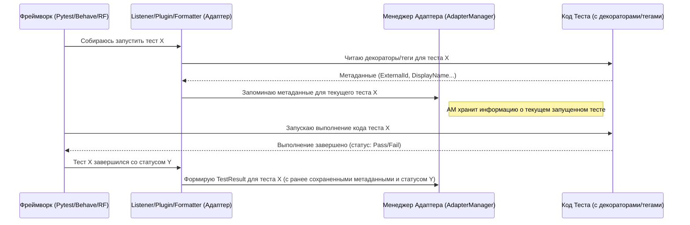
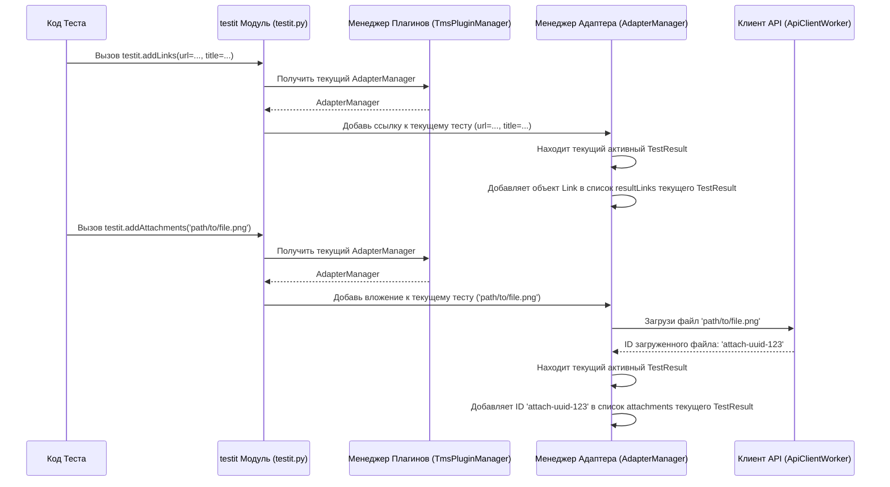

# Chapter 2: Пользовательский Интерфейс (Декораторы/Теги/Ключевые слова)


В [предыдущей главе](01_загрузка_конфигурации__appproperties__.md) мы разобрались, как адаптер собирает настройки (`AppProperties`), чтобы знать, куда и как отправлять результаты тестов. Теперь все готово для подключения к Test IT. Но как сам адаптер поймет, *какой именно* тест вы запускаете и какую дополнительную информацию о нем нужно передать?

Представьте, что ваши автотесты — это документы, которые нужно отправить в архив (Test IT). Просто отправить пачку безымянных бумаг — плохая идея. Нужно их как-то пометить:
*   Прикрепить **ярлычок** с уникальным номером и названием (чтобы легко найти в архиве).
*   Указать, с какими задачами или требованиями связан этот документ.
*   Во время "проверки" документа, возможно, понадобится добавить **заметку** ("Здесь нашли ошибку!") или прикрепить **скрепкой** дополнительный листок с результатами анализа.

Именно для таких "пометок" и "заметок" и существует **Пользовательский Интерфейс** в `adapters-python`. Это набор инструментов, который позволяет вам, как автотестировщику, управлять тем, как ваши тесты и их результаты будут выглядеть в Test IT.

Этот интерфейс состоит из двух основных частей:

1.  **Статическая разметка (Ярлычки):** Декораторы (для Pytest, Nose) или Теги (для Behave, Robot Framework). Они используются *перед* запуском теста, чтобы добавить к нему постоянную информацию (метаданные), такую как:
    *   `externalId`: Уникальный ID теста для связи с Test IT.
    *   `displayName`: Красивое имя теста, которое будет отображаться в Test IT.
    *   `workItemIds`: ID задач или требований (например, из Jira, Azure DevOps), связанных с этим тестом.
    *   `links`: Ссылки на документацию, баг-трекеры и т.д., относящиеся к этому тесту.
    *   И другие...
2.  **Динамическое добавление (Заметки и Скрепки):** Методы (для Pytest, Nose, Behave) или Ключевые слова (для Robot Framework). Они используются *во время* выполнения теста, чтобы добавить к его результату изменяющуюся информацию:
    *   `addLinks`: Добавить ссылку (например, на только что созданный баг-репорт).
    *   `addAttachments`: Прикрепить файл (например, скриншот ошибки или лог).
    *   `addMessage`: Добавить текстовое сообщение к результату теста.

Давайте рассмотрим обе части подробнее.

## Статическая Разметка: Декораторы и Теги

Это как постоянные метки на вашем тесте. Вы задаете их один раз в коде или файле сценария, и адаптер использует их каждый раз при запуске этого теста.

### Pytest / Nose (Декораторы)

В фреймворках Pytest и Nose для разметки используются декораторы Python — специальные конструкции, начинающиеся с символа `@`.

Вот простой пример для Pytest:

```python
# test_example.py
import pytest
import testit

# Важные ярлычки для Test IT
@testit.externalId('my-awesome-test-001')                         # Уникальный ID
@testit.displayName('Проверка входа пользователя с верными данными') # Понятное имя
@testit.workItemIds('PROJECT-123', 'PROJECT-456')                 # Связанные задачи
@testit.labels('UI', 'Login', 'Smoke')                             # Метки/теги
@testit.links(url='http://docs.example.com/login', title='Документация') # Ссылка

def test_successful_login():
    # Тело теста ...
    print("Логинимся...")
    # Допустим, мы вызываем какой-то сложный шаг
    perform_login('user', 'password')
    print("Проверяем результат...")
    assert is_user_logged_in()
    # ... конец теста

# Вспомогательные функции (не обязательно в этом же файле)
def perform_login(username, password):
    pass # Имитация логина

def is_user_logged_in():
    return True
```

**Объяснение:**

*   `@testit.externalId(...)`: Самый важный декоратор. Он задает уникальный идентификатор вашего автотеста. Именно по этому ID Test IT будет понимать, что результат этого запуска относится к конкретному автотесту в системе. Если автотеста с таким ID нет, Test IT может создать его автоматически (если включена опция `automaticCreationTestCases`).
*   `@testit.displayName(...)`: Задает имя, которое будет отображаться для этого теста в интерфейсе Test IT. Если его не указать, адаптер обычно использует имя функции (`test_successful_login`).
*   `@testit.workItemIds(...)`: Позволяет привязать автотест к одному или нескольким рабочим элементам (например, User Story в Jira, Requirement в Azure DevOps) по их ID. Это помогает отслеживать покрытие требований тестами.
*   `@testit.labels(...)`: Добавляет метки (теги) к автотесту в Test IT, помогая с категоризацией и фильтрацией.
*   `@testit.links(...)`: Добавляет постоянные ссылки к карточке автотеста в Test IT (не к результату конкретного запуска). Это могут быть ссылки на документацию, спецификации и т.д.

Благодаря этим "ярлычкам", когда результаты `test_successful_login` попадут в Test IT, они будут аккуратно привязаны к автотесту с ID `my-awesome-test-001`, отобразятся с понятным именем и будут связаны с задачами `PROJECT-123` и `PROJECT-456`.

> **Важно:** Все декораторы `testit` импортируются из пакета `testit`. Не забудьте `import testit` в начале файла.

### Behave (Теги)

В Behave для разметки используются теги, которые пишутся над `Feature` или `Scenario` в `.feature` файлах. Теги Test IT имеют специальный формат `ИмяПараметра=Значение` или `ИмяСписка=Значение1,Значение2`.

```gherkin
# features/login.feature
Feature: Аутентификация пользователя

  # Теги можно применять ко всему Feature или отдельным Scenario

  @ExternalId=my-awesome-test-001
  @DisplayName=Проверка входа пользователя с верными данными
  @WorkItemIds=PROJECT-123,PROJECT-456
  @Labels=UI,Login,Smoke
  @Links={"url":"http://docs.example.com/login", "title":"Документация"}
  Scenario: Успешный вход в систему
    Given Я нахожусь на странице входа
    When Я ввожу верные 'user' и 'password'
    Then Я должен увидеть приветственное сообщение

# Шаги определены в python-файлах (steps/login_steps.py) - их код не важен для примера тегов
```

**Объяснение:**

*   Формат тегов немного отличается от декораторов Python, но суть та же. Используются те же имена параметров (`ExternalId`, `DisplayName`, `WorkItemIds`, `Labels`, `Links`).
*   Значения указываются после знака `=`.
*   Для списков (как `WorkItemIds` или `Labels`) значения перечисляются через запятую.
*   Для ссылок (`Links`) используется более сложный формат, часто JSON-подобный словарь (или просто URL, если другие атрибуты не нужны). Подробнее смотрите в документации адаптера Behave.
*   Адаптер для Behave (который является [Formatter](03_точки_интеграции_с_фреймворками__listeners_plugins_formatters__.md)) парсит эти теги перед запуском сценария.

### Robot Framework (Теги)

Robot Framework также использует теги, которые указываются в секции `[Tags]` теста. Теги для Test IT имеют префикс `testit.` и используют двоеточие `:` для разделения имени и значения.

```robotframework
*** Settings ***
Documentation    Пример теста входа в систему
Library          testit_adapter_robotframework.TMSLibrary  # Подключаем библиотеку Test IT

*** Test Cases ***
Успешный вход пользователя
    [Documentation]    Проверяет вход с корректными данными
    [Tags]    testit.externalId:my-awesome-test-001
    ...       testit.displayName:Проверка входа пользователя с верными данными (RF)
    ...       testit.workItemsId:PROJECT-123    PROJECT-456  # Можно через пробел или список
    ...       testit.labels:UI    Login    Smoke
    ...       testit.links:${{{'url': 'http://docs.example.com/login', 'title':'Документация'}}} # Используем переменные RF для словаря
    Log    Выполняем вход
    Perform Login    user    password
    Log    Проверяем результат
    User Should Be Logged In

*** Keywords ***
Perform Login
    [Arguments]    ${username}    ${password}
    Log    Вход с ${username}/${password}
    # ... (реальные действия)

User Should Be Logged In
    Log    Проверка успешного входа
    # ... (реальные проверки)
```

**Объяснение:**

*   Формат тегов: `testit.ИмяПараметра:Значение`. Обратите внимание на префикс `testit.` и двоеточие.
*   Для параметров, принимающих списки (`workItemsId`, `labels`), значения можно перечислять через пробел или передавать как список Robot Framework.
*   Для сложных структур вроде ссылок (`links`) удобно использовать переменные Robot Framework типа "словарь" (dictionary), как показано в примере `${{{...}}}`.
*   Адаптер для Robot Framework (реализованный как [Listener и Library](03_точки_интеграции_с_фреймворками__listeners_plugins_formatters__.md)) считывает эти теги.

Независимо от фреймворка, цель статичной разметки — заранее предоставить адаптеру важную информацию о тесте для его корректной идентификации и отображения в Test IT.

## Динамическое добавление: Методы и Ключевые слова

Иногда информацию нужно добавить не к самому тесту, а к *результату* его конкретного прогона. Например, если тест упал, вы хотите прикрепить скриншот или лог именно к этому упавшему результату. Или если тест нашел баг, хочется добавить ссылку на баг-репорт прямо в результат. Это делается с помощью динамических методов или ключевых слов.

### Pytest / Nose / Behave (Методы)

В тестах, написанных на Python, вы можете использовать специальные функции из модуля `testit`:

```python
# test_dynamic_info.py
import pytest
import testit
import os # Для работы с путями

@testit.externalId('dynamic-test-002')
@testit.displayName('Тест с динамическими данными')
def test_with_dynamic_info():
    print("Начинаем тест...")
    # ... какая-то логика теста ...

    # Допустим, мы нашли проблему и хотим добавить ссылку на баг
    issue_url = 'http://bugtracker.example.com/issue/987'
    testit.addLinks(url=issue_url, title='Найденный баг', type=testit.LinkType.ISSUE) # Добавили ссылку

    # Имитируем ошибку
    try:
        result = 1 / 0
    except ZeroDivisionError as e:
        print("Произошла ошибка!")
        # Добавляем сообщение к результату
        testit.addMessage(f"Произошла ошибка во время вычислений: {e}")

        # Прикрепляем файл с логами (предположим, он есть)
        log_path = 'logs/test_run.log'
        if os.path.exists(log_path):
            testit.addAttachments(log_path) # Прикрепили файлик
            print(f"Прикреплен лог: {log_path}")
        else:
             # Можно прикрепить и просто текст как файл
             error_details = "Деление на ноль в модуле X."
             testit.addAttachments(error_details, is_text=True, name="error_details.txt")
             print("Прикреплены детали ошибки как текстовый файл.")

        # Важно: после добавления информации можно перевыбросить исключение или провалить тест
        pytest.fail(f"Тест упал из-за ошибки: {e}")

    # Если бы ошибки не было, тест бы прошел
    assert True
```

**Объяснение:**

*   `testit.addLinks(...)`: Добавляет одну или несколько ссылок к *результату* текущего выполняемого теста. В отличие от декоратора `@testit.links`, эта ссылка появится только у этого конкретного запуска теста. Можно указать `url`, `title`, `type` (используйте `testit.LinkType` для стандартных типов: `ISSUE`, `DEFECT`, `RELATED` и т.д.) и `description`.
*   `testit.addAttachments(...)`: Позволяет прикрепить один или несколько файлов к результату теста. Передайте путь к файлу. Адаптер загрузит этот файл в Test IT. Можно также передать текстовое содержимое, установив `is_text=True` и указав имя файла `name`, тогда адаптер создаст файл с этим текстом.
*   `testit.addMessage(...)`: Добавляет простое текстовое сообщение к результату теста. Это удобно для вывода краткой информации о причине падения или каких-то важных событиях во время теста.

Эти методы можно вызывать в любом месте внутри вашего теста. Они позволяют обогатить отчет о прогоне теста актуальной информацией, возникшей во время его выполнения.

### Robot Framework (Ключевые слова)

В Robot Framework для динамического добавления информации используются ключевые слова, предоставляемые библиотекой `testit_adapter_robotframework.TMSLibrary` (которую мы подключили в `*** Settings ***`).

```robotframework
*** Settings ***
Documentation    Пример теста с динамическими данными
Library          testit_adapter_robotframework.TMSLibrary
Library          OperatingSystem    # Для проверки существования файла

*** Test Cases ***
Тест с добавлением информации во время выполнения
    [Tags]    testit.externalId:dynamic-rf-test-003
    Log    Начинаем тест...
    # ... какая-то логика ...

    # Нашли баг
    ${issue_url}=    Set Variable    http://bugtracker.example.com/issue/988
    Add Link    url=${issue_url}    title=Найденный баг (RF)   type=Issue  # Добавляем ссылку

    # Имитируем ошибку
    Log    Сейчас будет ошибка
    Run Keyword And Expect Error    *    Simulate Error    # Ожидаем ошибку от ключевого слова

    # Этот код выполнится, если ошибка была поймана (или после Fail)
    ${error_message}=    Set Variable    Произошла ошибка в Simulate Error
    Add Message    ${error_message}    # Добавляем сообщение

    ${log_path}=    Set Variable    logs/robot_run.log
    ${exists}=    Run Keyword And Return Status    OperatingSystem.File Should Exist    ${log_path}
    IF    ${exists}
        Add Attachments    ${log_path}   # Прикрепляем файл
        Log    Прикреплен лог: ${log_path}
    ELSE
        ${error_details}=    Set Variable    Деление на ноль в Robot.
        Add Attachment    ${error_details}    error_details_rf.txt # Прикрепляем текст как файл
        Log    Прикреплены детали ошибки как текст.
    END

    Fail    Тест завершился ошибкой намеренно # Провалим тест явно

*** Keywords ***
Simulate Error
    Log    Делаем что-то, что вызовет ошибку
    ${result}=    Evaluate    1 / 0
    # Эта строка не выполнится
```

**Объяснение:**

*   `Add Link`: Аналог `testit.addLink` для добавления одной ссылки к результату. Принимает параметры `url`, `title`, `type`, `description`.
*   `Add Links`: Позволяет добавить сразу несколько ссылок (обычно передается переменная-список словарей).
*   `Add Attachments`: Аналог `testit.addAttachments` для прикрепления одного или нескольких файлов по их путям.
*   `Add Attachment`: Аналог `testit.addAttachments(..., is_text=True, name=...)` для прикрепления текстового содержимого как файла. Принимает текст и имя файла.
*   `Add Message`: Аналог `testit.addMessage` для добавления текстового сообщения к результату.

Использование этих ключевых слов позволяет так же, как и в Python, динамически обогащать результаты тестов в Robot Framework.

## Как это работает "под капотом"?

Давайте кратко заглянем внутрь, чтобы понять, как адаптер обрабатывает эту информацию.

### Обработка Статической Разметки (Декораторы/Теги)

1.  **Инициация Теста:** Когда фреймворк (Pytest, Behave, Robot Framework) собирается запустить ваш тест (функцию, сценарий), он уведомляет об этом специальный компонент адаптера — [Listener/Plugin/Formatter](03_точки_интеграции_с_фреймворками__listeners_plugins_formatters__.md).
2.  **Чтение Метаданных:** Этот компонент-"слушатель" проверяет наличие декораторов `testit` (в Pytest/Nose) или парсит теги (`@ExternalId=...` или `testit.externalId:...`) в Behave/Robot Framework, связанные с запускаемым тестом.
3.  **Сохранение Информации:** Слушатель извлекает значения (`externalId`, `displayName`, `workItemIds` и т.д.) и сохраняет их. Эта информация будет использована для создания или обновления данных об автотесте в Test IT и для формирования объекта [Модели Данных (TestResult)](04_модели_данных__testresult__stepresult__link_и_др___.md), который будет отправлен в Test IT после завершения теста.



Например, в адаптере для Behave есть файл `tags_parser.py`, который содержит логику для разбора тегов:

```python
# testit-adapter-behave/src/testit_adapter_behave/tags_parser.py
# (Упрощено для примера)
from .models.tags import TagType # Содержит константы вроде 'ExternalId='

def parse_tags(tags): # На вход поступает список тегов сценария
    parsed_tags = {
        TagType.LINKS: [],
        TagType.LABELS: [],
        TagType.WORK_ITEM_IDS: []
    }

    for tag in tags:
        if TagType.EXTERNAL_ID in tag:
            # Извлекаем значение после 'ExternalId='
            parsed_tags[TagType.EXTERNAL_ID] = tag[len(TagType.EXTERNAL_ID):]
        elif TagType.DISPLAY_NAME in tag:
            # Извлекаем значение после 'DisplayName='
            parsed_tags[TagType.DISPLAY_NAME] = tag[len(TagType.DISPLAY_NAME):]
        # ... и так далее для других типов тегов ...

    return parsed_tags # Возвращаем словарь с разобранными метаданными
```

Эта функция вызывается Formatter'ом Behave перед началом выполнения Scenario.

### Обработка Динамических Данных (Методы/Ключевые слова)

1.  **Вызов Метода/Ключевого слова:** Ваш тест выполняет код `testit.addLinks(...)` (или `Add Link` в Robot Framework).
2.  **Передача в Адаптер:** Эта функция (или ключевое слово) внутри себя обращается к [Менеджеру Адаптера (AdapterManager)](06_менеджер_адаптера__adaptermanager__.md) (часто через [Менеджер Плагинов TMS (TmsPluginManager)](07_менеджер_плагинов_tms__tmspluginmanager__.md)).
3.  **Добавление к Текущему Результату:** `AdapterManager` знает, какой тест выполняется в данный момент. Он берет переданные данные (ссылку, путь к файлу, сообщение) и добавляет их к объекту [TestResult](04_модели_данных__testresult__stepresult__link_и_др___html), который накапливает информацию о текущем прогоне теста. Если вызывается `addAttachments`, `AdapterManager` также взаимодействует с [Клиентом API (ApiClientWorker)](08_клиент_api__apiclientworker__.md) для загрузки файла в Test IT и получения его ID, который затем добавляется к результату.



Логика динамических методов находится в `testit-python-commons/src/testit_python_commons/dynamic_methods.py`. Вот упрощенный пример для `addLinks`:

```python
# testit-python-commons/src/testit_python_commons/dynamic_methods.py
from testit_python_commons.services import TmsPluginManager, Utils
from testit_python_commons.services.logger import adapter_logger

@adapter_logger
def addLinks(url: str = None, ..., links: list or tuple = None): # noqa: N802
    # Проверяем, есть ли у текущего плагина фреймворка метод для добавления ссылок
    if hasattr(TmsPluginManager.get_plugin_manager().hook, 'add_link'):
        if url:
            # Конвертируем словарь/параметры в модель Link
            link_model = Utils.convert_link_dict_to_link_model({
                "url": url,
                # ... другие параметры ...
            })
            # Вызываем метод хука плагина, который обычно передает управление AdapterManager'у
            TmsPluginManager.get_plugin_manager().hook.add_link(link=link_model)
        elif links and (isinstance(links, list) or isinstance(links, tuple)):
            # Обрабатываем список ссылок
            for link_data in links:
                if isinstance(link_data, dict) and 'url' in link_data:
                     link_model = Utils.convert_link_dict_to_link_model(link_data)
                     TmsPluginManager.get_plugin_manager().hook.add_link(link=link_model)
                # ... обработка ошибок ...
        # ... обработка ошибок ...
```

Эта функция, по сути, является точкой входа, которая преобразует пользовательские данные в [Модели Данных](04_модели_данных__testresult__stepresult__link_и_др___.md) и передает их дальше по цепочке в `AdapterManager` для добавления к текущему результату теста.

## Заключение

В этой главе мы рассмотрели "Пользовательский Интерфейс" адаптеров — то, как вы можете взаимодействовать с ними из своих автотестов. Мы научились:

*   Использовать **декораторы** (Pytest/Nose) и **теги** (Behave/Robot Framework) для добавления статических метаданных к тестам (`externalId`, `displayName`, `workItemIds` и т.д.), чтобы правильно идентифицировать и описать их в Test IT.
*   Использовать **методы** (`addLinks`, `addAttachments`, `addMessage` в Python) и **ключевые слова** (в Robot Framework) для добавления динамической информации (ссылок, вложений, сообщений) к *результатам* тестов прямо во время их выполнения.

Эти инструменты позволяют сделать ваши отчеты в Test IT гораздо более информативными и полезными. Вы теперь можете не просто видеть статус Pass/Fail, но и связывать тесты с требованиями, видеть понятные имена, прикреплять артефакты и добавлять контекст к результатам.

Но как адаптер узнает, когда тест начался, а когда закончился? Как он перехватывает статус (успех, падение, пропуск)? Как именно он получает доступ к декораторам и тегам? За эту интеграцию с тестовыми фреймворками отвечают специальные компоненты, о которых мы поговорим в следующей главе.

**Далее:** [Глава 3: Точки Интеграции с Фреймворками (Listeners/Plugins/Formatters)](03_точки_интеграции_с_фреймворками__listeners_plugins_formatters__.md)

---

Generated by [AI Codebase Knowledge Builder](https://github.com/The-Pocket/Tutorial-Codebase-Knowledge)