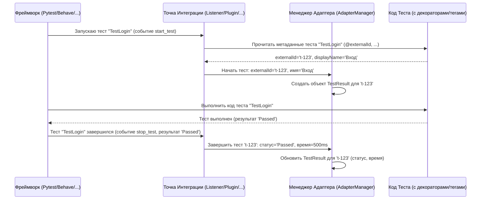

# Chapter 3: Точки Интеграции с Фреймворками (Listeners/Plugins/Formatters)


В [предыдущей главе](02_пользовательский_интерфейс__декораторы_теги_ключевые_слова__.md) мы научились "украшать" наши тесты с помощью декораторов, тегов и специальных методов/ключевых слов. Мы узнали, как пометить тест уникальным `externalId`, добавить ссылки или прикрепить скриншоты. Но возникает вопрос: а как адаптер Test IT вообще *узнает* об этих вещах? Когда именно он считывает `@testit.externalId`? Как он понимает, что тест начался, завершился, успешно прошел или упал?

Представьте, что ваш тестовый фреймворк (Pytest, Behave, Nose или Robot Framework) — это спортивный стадион, где проходят соревнования (ваши тесты). А [Менеджер Адаптера (AdapterManager)](06_менеджер_адаптера__adaptermanager__.md) — это главный редактор новостного агентства (Test IT), который хочет получить отчет о каждом матче. Редактор не может сам бегать по стадиону и следить за всем. Ему нужен специальный корреспондент прямо на месте!

Вот эти "корреспонденты" на стадионе — и есть **Точки Интеграции с Фреймворками**.

## Что такое Точки Интеграции?

Точки Интеграции — это специальные компоненты адаптера, которые "внедряются" в сам тестовый фреймворк. Каждый фреймворк устроен по-своему и имеет свой собственный способ сообщать о событиях во время выполнения тестов:
*   "Соревнование (тест) началось!"
*   "Спортсмен (шаг теста) сделал попытку!"
*   "Соревнование (тест) закончилось!"
*   "Результат соревнования: победа/поражение/ничья (Pass/Fail/Skip)!"

Для каждого фреймворка адаптер предоставляет своего "корреспондента", который понимает "язык" именно этого фреймворка. В зависимости от фреймворка, эти компоненты могут называться по-разному:
*   **Pytest:** Использует систему **Plugins** (Плагины). Наш адаптер регистрирует свой плагин (`TmsListener`), который "слушает" события Pytest.
*   **Behave:** Использует систему **Formatters** (Форматтеры). Адаптер предоставляет `AdapterFormatter`, который обрабатывает события сценариев и шагов.
*   **Nose (nose2):** Использует систему **Plugins** (Плагины). Адаптер предоставляет `TmsPlugin`.
*   **Robot Framework:** Использует систему **Listeners** (Слушатели, как `AutotestAdapter`) и **Libraries** (Библиотеки, как `TMSLibrary`).

**Аналогия:** Представьте, что у нас есть международная конференция (тест-ран). Фреймворки — это докладчики, говорящие на разных языках (Pytest говорит на "пайтестовом", Behave — на "бихейвовом"). [AdapterManager](06_менеджер_адаптера__adaptermanager__.md) — это организатор, который хочет собрать всю информацию на одном общем языке. Listeners/Plugins/Formatters — это синхронные переводчики, каждый из которых сидит рядом со своим докладчиком, слушает его и переводит на общий язык, понятный организатору.

**Главная задача этих точек интеграции:**
1.  **Слушать:** Перехватывать сигналы (события) от фреймворка.
2.  **Понимать:** Интерпретировать эти сигналы (например, "это начало теста", "это результат шага").
3.  **Извлекать:** Собирать нужную информацию (имя теста, статус, сообщения об ошибках, метаданные из декораторов/тегов).
4.  **Передавать:** Сообщать эту информацию [Менеджеру Адаптера (AdapterManager)](06_менеджер_адаптера__adaptermanager__.md) в стандартизированном виде.

## Как это работает на примере?

Давайте вернемся к нашему Pytest-тесту из предыдущей главы:

```python
# test_example.py
import pytest
import testit

@testit.externalId('my-awesome-test-001') # <--- Кто это читает?
@testit.displayName('Проверка входа')
def test_successful_login():               # <--- Кто знает, что он начался?
    print("Логинимся...")
    assert True                            # <--- Кто узнает результат?
```

1.  **Запуск:** Вы запускаете `pytest`. Pytest начинает собирать тесты.
2.  **Плагин Активируется:** Pytest обнаруживает и активирует наш плагин Test IT (`TmsListener`).
3.  **Начало Теста:** Pytest собирается запустить `test_successful_login`. Он посылает сигнал "start test" (начать тест).
4.  **Перехват События:** `TmsListener` (наш "корреспондент" для Pytest) перехватывает этот сигнал.
5.  **Чтение Метаданных:** `TmsListener` "смотрит" на тест `test_successful_login` и видит декораторы `@testit.externalId` и `@testit.displayName`. Он считывает их значения ('my-awesome-test-001', 'Проверка входа').
6.  **Сообщение Менеджеру:** `TmsListener` сообщает [AdapterManager](06_менеджер_адаптера__adaptermanager__.md): "Эй, начинается тест! Его externalId='my-awesome-test-001', displayName='Проверка входа', а внутреннее имя `test_successful_login`". AdapterManager создает "черновик" результата для этого теста.
7.  **Выполнение Теста:** Pytest выполняет код внутри `test_successful_login`.
8.  **Конец Теста:** Тест завершается (в нашем случае успешно). Pytest посылает сигнал "stop test" (завершить тест), указывая результат "passed".
9.  **Перехват Результата:** `TmsListener` перехватывает и этот сигнал.
10. **Сообщение Менеджеру:** `TmsListener` сообщает [AdapterManager](06_менеджер_адаптера__adaptermanager__.md): "Тест 'my-awesome-test-001' завершился со статусом 'Passed'". AdapterManager обновляет "черновик" результата, добавляя статус и время выполнения.

Похожий процесс происходит и для других фреймворков, только "корреспонденты" (Formatters, другие Plugins, Listeners) и сигналы будут немного другими.

## Заглянем "под капот"

Как же эти "корреспонденты" общаются с фреймворками и `AdapterManager`?

### Общая схема взаимодействия:



Ключевая идея в том, что **Точка Интеграции регистрируется во фреймворке и реализует специальные методы**, которые фреймворк сам вызывает в нужные моменты (начало теста, конец теста, начало шага, конец шага и т.д.). Внутри этих методов "корреспондент" выполняет свою работу: собирает информацию и передает ее `AdapterManager`.

### Пример кода (Pytest)

В адаптере для Pytest есть класс `TmsListener`. Pytest позволяет плагинам определять методы, которые вызываются при определенных событиях. Эти методы называются "хуками" (hooks).

Файл: `testit-adapter-pytest/src/testit_adapter_pytest/listener.py`

```python
class TmsListener(object):
    # ... (пропущена инициализация с AdapterManager)

    def __init__(self, adapter_manager: AdapterManager, step_manager: StepManager, fixture_manager: FixtureManager):
        self.__adapter_manager = adapter_manager # <--- Получаем доступ к менеджеру!
        # ...

    # Хук Pytest: вызывается перед запуском протокола теста
    @pytest.hookimpl(tryfirst=True)
    def pytest_runtest_protocol(self, item):
        # 'item' содержит информацию о тесте
        # utils.form_test считывает декораторы и создает "черновик" теста
        self.__executable_test = utils.form_test(item)
        # НЕ отправляем в AdapterManager сразу, т.к. могут быть фикстуры

    # Хук Pytest: вызывается при получении отчета о событии теста (setup, call, teardown)
    @pytest.hookimpl
    def pytest_runtest_logreport(self, report):
        if self.__executable_test:
            # Обрабатываем разные стадии: setup, call
            if report.when == 'call':
                # Получаем статус ('passed', 'failed', 'skipped')
                status = STATUS.get(report.outcome, None)
                self.__executable_test.outcome = status # Запоминаем статус

            # Если тест упал, запоминаем детали ошибки
            if report.failed:
                self.__executable_test.outcome = STATUS.get('failed', None)
                if report.longreprtext:
                    self.__executable_test.traces = report.longreprtext

            # Накапливаем время выполнения
            self.__executable_test.duration += report.duration * 1000

    # Хук Pytest: вызывается после завершения всех стадий теста
    @pytest.hookimpl
    def pytest_runtest_logfinish(self):
        if not self.__executable_test:
            return

        # Вот теперь тест точно завершен!
        # Преобразуем собранную информацию в финальную модель TestResult
        test_result_model = utils.convert_executable_test_to_test_result_model(
            self.__executable_test)
        # Отправляем готовый результат менеджеру
        self.__adapter_manager.write_test(test_result_model)

    # ... (другие хуки для фикстур, шагов и т.д.)
```

**Объяснение:**
*   `TmsListener` хранит ссылку на [AdapterManager](06_менеджер_адаптера__adaptermanager__.md) (передается при инициализации).
*   Метод `pytest_runtest_protocol` вызывается Pytest *перед* началом выполнения теста. Здесь `TmsListener` использует хелпер `utils.form_test` для сбора статической информации (из декораторов).
*   Метод `pytest_runtest_logreport` вызывается *несколько раз* во время выполнения теста (для стадий setup, call, teardown). Здесь `TmsListener` обновляет информацию о статусе, ошибках и времени.
*   Метод `pytest_runtest_logfinish` вызывается *после* полного завершения теста. Здесь `TmsListener` берет всю собранную информацию, упаковывает ее в объект [данных (TestResult)](04_модели_данных__testresult__stepresult__link_и_др___.md) и передает в `AdapterManager`, вызывая `self.__adapter_manager.write_test(...)`.

### Пример кода (Behave)

В Behave используется Formatter.

Файл: `testit-adapter-behave/src/testit_adapter_behave/formatter.py`

```python
from behave.formatter.base import Formatter
from testit_python_commons.services import TmsPluginManager # Для доступа к AdapterManager
from .listener import AdapterListener # Компонент, который реально общается с AdapterManager

class AdapterFormatter(Formatter):
    def __init__(self, stream_opener, config):
        super(AdapterFormatter, self).__init__(stream_opener, config)
        # Получаем AdapterManager через TmsPluginManager
        adapter_manager = TmsPluginManager.get_adapter_manager(...)
        # Создаем Listener, который будет обрабатывать события
        self.__listener = AdapterListener(adapter_manager, ...)
        # Регистрируем Listener для обработки динамических вызовов (addLink и т.д.)
        TmsPluginManager.get_plugin_manager().register(self.__listener)

    # Метод Behave: вызывается перед Feature
    def feature(self, feature):
        # Можно фильтровать сценарии, если нужно
        pass

    # Метод Behave: вызывается перед Scenario
    def scenario(self, scenario):
        # Передаем сценарий в Listener для обработки (чтение тегов, старт теста)
        self.__listener.get_scenario(scenario)

    # Метод Behave: вызывается перед Шагом (Step)
    def match(self, match):
        # Передаем детали шага в Listener (для параметров)
        self.__listener.get_step_parameters(match)

    # Метод Behave: вызывается после Шага (Step) с результатом
    def result(self, step):
        # Передаем результат шага в Listener (статус, время)
        self.__listener.get_step_result(step)

    # Метод Behave: вызывается в самом конце
    def close_stream(self):
        # Сигнализируем Listener, что все тесты завершены
        self.__listener.stop_launch()
```

**Объяснение:**
*   `AdapterFormatter` получает доступ к `AdapterManager` и создает `AdapterListener`.
*   Behave вызывает методы форматтера (`feature`, `scenario`, `match`, `result`) в процессе выполнения.
*   `AdapterFormatter` просто перенаправляет эти вызовы в `AdapterListener`.
*   Именно `AdapterListener` (код которого показан частично в `testit-adapter-behave/src/testit_adapter_behave/listener.py`) P_already provided содержит логику извлечения информации из тегов (`parse_scenario`), обработки результатов шагов и вызова соответствующих методов `AdapterManager` для старта и завершения тестов/шагов.

Похожие принципы используются и в адаптерах для Nose и Robot Framework: создается специальный класс (Plugin или Listener), который регистрируется во фреймворке и реализует методы, вызываемые фреймворком при ключевых событиях тестового цикла. Эти методы собирают данные и передают их `AdapterManager`.

## Заключение

В этой главе мы познакомились с "ушами" и "глазами" адаптера — **Точками Интеграции с Фреймворками**. Мы узнали, что:
*   Это специальные компоненты (Plugins, Listeners, Formatters), адаптированные для каждого тестового фреймворка (Pytest, Behave, Nose, Robot Framework).
*   Их задача — "слушать" события, происходящие во время запуска тестов (старт теста, шаг, результат, завершение).
*   Они извлекают необходимую информацию (метаданные из декораторов/тегов, статус выполнения, ошибки, время).
*   Они действуют как "переводчики", передавая собранную информацию в едином формате главному компоненту — [Менеджеру Адаптера (AdapterManager)](06_менеджер_адаптера__adaptermanager__.md).

Теперь мы понимаем, как адаптер узнает, что происходит внутри фреймворка во время тестов. Но в каком виде эта информация передается? Как структурированы данные о результате теста, шагах, ссылках? Об этом мы поговорим в следующей главе, посвященной моделям данных.

**Далее:** [Глава 4: Модели Данных (TestResult, StepResult, Link и др.)](04_модели_данных__testresult__stepresult__link_и_др___.md)

---

Generated by [AI Codebase Knowledge Builder](https://github.com/The-Pocket/Tutorial-Codebase-Knowledge)