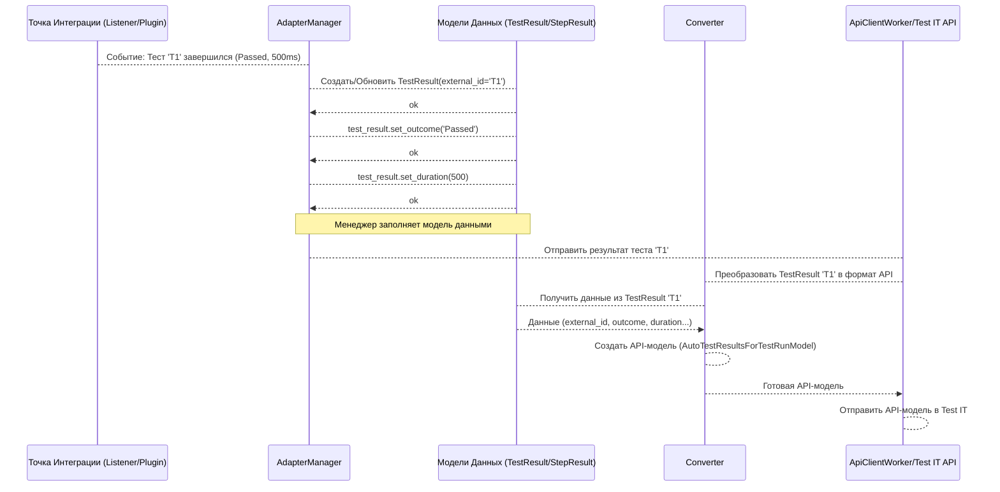

# Chapter 4: Модели Данных (TestResult, StepResult, Link и др.)


В [предыдущей главе](03_точки_интеграции_с_фреймворками__listeners_plugins_formatters__.md) мы узнали, как специальные "корреспонденты" адаптера (Listeners, Plugins, Formatters) следят за ходом выполнения тестов в разных фреймворках. Они собирают всю важную информацию: какой тест запущен, как он называется, какие шаги выполняет, какой у него результат (успех или провал), какие метаданные к нему прикреплены.

Теперь представьте: "корреспондент" от Pytest присылает отчет в одном виде, "корреспондент" от Behave — в другом, а от Robot Framework — в третьем. Если бы [Менеджер Адаптера (AdapterManager)](06_менеджер_адаптера__adaptermanager__.md) получал всю эту информацию вразноброс, ему было бы очень сложно понять, что с ней делать дальше и как отправить в Test IT.

Нужен единый стандарт, общий язык, на котором будут "говорить" все компоненты адаптера. Как унифицированный бланк для отчета о тесте, который заполняют все "корреспонденты", независимо от того, на каком "стадионе" (фреймворке) они работают.

Именно эту задачу решают **Модели Данных**.

## Что такое Модели Данных?

Модели Данных — это, по сути, **стандартизированные "формы" или "шаблоны"** для хранения информации о тестах и их результатах. В коде они представлены как Python классы со строго определенным набором полей (атрибутов).

**Аналогия:** Представьте, что вы заполняете анкету для получения паспорта. Есть строгие поля: ФИО, дата рождения, место рождения и т.д. Вы не можете написать свою биографию в вольной форме — нужно заполнить конкретные графы. Модели данных — это такие же "анкеты" для информации о тестах.

Независимо от того, использует ваш проект Pytest, Behave или Robot Framework, вся информация о:
*   Результате выполнения теста
*   Выполненных шагах
*   Прикрепленных ссылках
*   Вложенных файлах
*   Метаданных (External ID, Display Name и т.д.)

...приводится к единому формату с помощью этих моделей. Это делает дальнейшую обработку данных и их отправку в Test IT через [Клиент API (ApiClientWorker)](08_клиент_api__apiclientworker__.md) намного проще и надежнее.

Давайте познакомимся с основными "анкетами":

### 1. `TestResult` — Главный бланк отчета о тесте

Это основная модель, которая содержит всю информацию о *конкретном запуске* одного автотеста. Представьте её как основной бланк отчета, в который вносится всё самое важное.

Ключевые поля (атрибуты) в `TestResult`:

*   `__external_id`: Тот самый уникальный ID, который мы задаем через `@testit.externalId` или тег ([Глава 2](02_пользовательский_интерфейс__декораторы_теги_ключевые_слова__.md)). По нему Test IT связывает результат с автотестом.
*   `__autotest_name`: Имя теста, которое будет отображаться в Test IT (из `@testit.displayName` или имя функции/сценария).
*   `__outcome`: Итоговый статус выполнения теста ('Passed', 'Failed', 'Skipped').
*   `__duration`: Время выполнения теста в миллисекундах.
*   `__started_on`, `__completed_on`: Время начала и окончания теста.
*   `__step_results`: Список результатов **шагов** внутри этого теста (каждый элемент — это объект `StepResult`).
*   `__setup_results`, `__teardown_results`: Списки результатов шагов из подготовительных (setup) и завершающих (teardown) процедур.
*   `__links`: Список статических ссылок, привязанных к самому автотесту (из `@testit.links` или тегов). Каждый элемент — объект `Link`.
*   `__result_links`: Список динамических ссылок, добавленных во время выполнения этого конкретного теста (через `testit.addLinks`). Каждый элемент — объект `Link`.
*   `__attachments`: Список ID вложенных файлов, прикрепленных к этому результату (через `testit.addAttachments`).
*   `__message`: Текстовое сообщение, добавленное к результату (через `testit.addMessage`).
*   `__traces`: Текст ошибки (стектрейс), если тест упал.
*   `__work_item_ids`: Список ID связанных рабочих элементов (из `@testit.workItemIds`).
*   `__labels`: Список меток (из `@testit.labels`).
*   `__parameters`: Словарь с параметрами, с которыми запускался тест (актуально для параметризованных тестов).
*   ... и другие поля для дополнительной информации (`namespace`, `classname`, `description`, `properties`).

**Пример использования (концептуальный):**

Когда [Точка Интеграции](03_точки_интеграции_с_фреймворками__listeners_plugins_formatters__.md) перехватывает событие завершения теста, она передает всю собранную информацию [Менеджеру Адаптера (AdapterManager)](06_менеджер_адаптера__adaptermanager__.md). `AdapterManager` создает объект `TestResult` и заполняет его поля:

```python
# Это происходит внутри AdapterManager (упрощенно)
from testit_python_commons.models.test_result import TestResult

# Информация пришла от Listener'а/Formatter'а
external_id = 'my-test-001'
name = 'Проверка входа'
outcome = 'Failed'
duration_ms = 1250
error_trace = 'AssertionError: Ожидался True, получили False'
# ... другая информация ...

# Создаем и заполняем модель
test_result = TestResult()
test_result.set_external_id(external_id)
test_result.set_autotest_name(name)
test_result.set_outcome(outcome)
test_result.set_duration(duration_ms)
test_result.set_traces(error_trace)
# ... заполняем остальные поля ...

# Теперь test_result содержит всю информацию в стандартном виде
# и готов к отправке в Test IT
```

Вам, как пользователю адаптера, обычно **не нужно** вручную создавать или заполнять объекты `TestResult`. Это делает сам адаптер "под капотом".

### 2. `StepResult` — Бланк отчета для отдельного шага

Если ваш тест состоит из нескольких логических шагов (например, с использованием `with testit.step(...)` в Pytest или ключевых слов в Robot Framework), то результаты каждого такого шага сохраняются в модели `StepResult`. Это как вложенный бланк в основном отчете, описывающий одну конкретную задачу.

Ключевые поля `StepResult`:

*   `__title`: Название шага.
*   `__description`: Описание шага (если есть).
*   `__outcome`: Статус выполнения шага ('Passed', 'Failed', 'Skipped').
*   `__duration`: Время выполнения шага.
*   `__started_on`, `__completed_on`: Время начала и окончания шага.
*   `__step_results`: Список результатов **вложенных** шагов (если шаги могут быть иерархическими). Да, `StepResult` может содержать другие `StepResult`!
*   `__attachments`: Список ID вложений, прикрепленных *именно к этому шагу*.
*   `__parameters`: Параметры, специфичные для этого шага.

**Пример использования (концептуальный):**

Когда вы используете менеджер шагов ([Глава 5](05_менеджер_шагов__stepmanager__и_контекст_шага__step__.md)), он создает и заполняет объекты `StepResult`, а затем добавляет их в список `__step_results` текущего `TestResult` (или родительского `StepResult`).

```python
# Это происходит внутри StepManager (упрощенно)
from testit_python_commons.models.step_result import StepResult

# Информация о шаге
step_title = 'Ввод логина и пароля'
step_outcome = 'Passed'
step_duration_ms = 300
# ...

# Создаем модель шага
step_result = StepResult()
step_result.set_title(step_title)
step_result.set_outcome(step_outcome)
step_result.set_duration(step_duration_ms)
# ...

# Добавляем этот шаг к основному результату теста
current_test_result.get_step_results().append(step_result)
```

### 3. `Link` — Форма для добавления ссылки

Эта модель используется для представления гиперссылок, которые вы добавляете либо статически к тесту (`@testit.links`), либо динамически к результату (`testit.addLinks`).

Ключевые поля `Link`:

*   `__url`: Сам URL-адрес ссылки.
*   `__title`: Название ссылки (как она будет отображаться).
*   `__link_type`: Тип ссылки (например, 'Issue', 'Defect', 'Requirement', 'Repository'). Используется для классификации в Test IT.
*   `__description`: Дополнительное описание ссылки.

**Пример использования (концептуальный):**

Когда вы вызываете `testit.addLinks(...)` ([Глава 2](02_пользовательский_интерфейс__декораторы_теги_ключевые_слова__.md)), внутри адаптера создается объект `Link` и добавляется в список `__result_links` текущего `TestResult`.

```python
# Это происходит внутри testit.addLinks (упрощенно)
from testit_python_commons.models.link import Link
from testit_python_commons.models.link_type import LinkType

# Данные из вызова testit.addLinks
url = 'http://bugtracker.example.com/bug/123'
title = 'Найденный баг'
type = LinkType.DEFECT # Используем перечисление LinkType

# Создаем модель ссылки
link = Link()
link.set_url(url)
link.set_title(title)
link.set_link_type(type)

# Добавляем ссылку к текущему результату теста
current_test_result.get_result_links().append(link)
```

### Другие модели

Существуют и другие модели для представления специфической информации, например:
*   `Label`: Для хранения метки (из `@testit.labels`).
*   `FixtureResult`, `FixturesContainer`: Для информации о фикстурах (setup/teardown).

Основная идея остается той же: стандартизация данных.

## Как это работает "под капотом"?

Модели данных — это пассивные контейнеры. Они сами ничего не делают, только хранят информацию. Активные компоненты, такие как [Точки Интеграции](03_точки_интеграции_с_фреймворками__listeners_plugins_formatters__.md), [Менеджер Адаптера (AdapterManager)](06_менеджер_адаптера__adaptermanager__.md) и [Менеджер Шагов (StepManager)](05_менеджер_шагов__stepmanager__и_контекст_шага__step__.md), создают и заполняют эти модели. Затем [ApiClientWorker](08_клиент_api__apiclientworker__.md) берет готовую модель (например, `TestResult`) и преобразует ее в формат, понятный для API Test IT.

**Процесс:**

1.  **Сбор данных:** [Точка Интеграции](03_точки_интеграции_с_фреймворками__listeners_plugins_formatters__.md) собирает информацию о событии теста (старт, стоп, шаг) и метаданные.
2.  **Передача Менеджеру:** Информация передается [AdapterManager](06_менеджер_адаптера__adaptermanager__.md) (или [StepManager](05_менеджер_шагов__stepmanager__и_контекст_шага__step__.md) для шагов).
3.  **Создание/Обновление Модели:** Менеджер создает новый объект модели (`TestResult`, `StepResult`) или обновляет существующий, заполняя его поля полученными данными. Динамические вызовы (`testit.addLinks` и др.) также приводят к обновлению соответствующих полей в текущей активной модели.
4.  **Конвертация для API:** Когда результат теста готов к отправке, [ApiClientWorker](08_клиент_api__apiclientworker__.md) использует специальный `Converter`, чтобы преобразовать нашу внутреннюю модель (`TestResult`) в модель, ожидаемую библиотекой `testit-api-client` (например, `AutoTestResultsForTestRunModel`).
5.  **Отправка:** `ApiClientWorker` отправляет сконвертированные данные в Test IT через API.

**Диаграмма Последовательности:**



### Немного кода

Модели данных определены в основном в пакете `testit-python-commons`.

**Пример: `testit-python-commons/src/testit_python_commons/models/test_result.py` (упрощенно)**
```python
# testit-python-commons/src/testit_python_commons/models/test_result.py
import typing
from testit_python_commons.models.link import Link
from testit_python_commons.models.step_result import StepResult
# ... другие импорты и декоратор @adapter_logger ...

class TestResult:
    # Приватные атрибуты для хранения данных
    __external_id: str = None
    __autotest_name: str = None
    __outcome: str = None
    __duration: int = None
    # ... много других атрибутов ...
    __step_results: typing.List[StepResult] = []
    __result_links: typing.List[Link] = []
    __attachments: typing.List[str] = []

    # Публичные методы-"сеттеры" для установки значений
    # @adapter_logger # Декоратор для логирования
    def set_external_id(self, external_id: str):
        self.__external_id = external_id
        return self # Возвращает self для цепочки вызовов

    # @adapter_logger
    def set_outcome(self, outcome: str):
        self.__outcome = outcome
        return self

    # ... много других сеттеров ...

    # Публичные методы-"геттеры" для получения значений
    # @adapter_logger
    def get_external_id(self) -> str:
        return self.__external_id

    # @adapter_logger
    def get_outcome(self) -> str:
        return self.__outcome

    # ... много других геттеров ...

    # Методы для работы со списками (пример)
    def get_result_links(self) -> list:
         # При первом обращении инициализируем список, если нужно
         if self.__result_links is None: self.__result_links = []
         return self.__result_links

    def get_step_results(self) -> list:
         if self.__step_results is None: self.__step_results = []
         return self.__step_results
```
*   Класс `TestResult` использует приватные атрибуты (с `__`) для хранения данных.
*   Публичные методы `set_...` и `get_...` предоставляют контролируемый доступ к этим данным.
*   Списки (`__step_results`, `__result_links` и т.д.) обычно инициализируются пустыми и затем наполняются через геттер и `append()`.

**Пример: `testit-python-commons/src/testit_python_commons/models/link.py` (упрощенно)**
```python
# testit-python-commons/src/testit_python_commons/models/link.py
from testit_python_commons.models.link_type import LinkType
# ...

class Link:
    __url: str = None
    __title: str = None
    __link_type: LinkType = None
    __description: str = None

    # @adapter_logger
    def set_url(self, url: str):
        self.__url = url
        return self

    # @adapter_logger
    def get_url(self) -> str:
        return self.__url

    # ... сеттеры и геттеры для title, link_type, description ...
```
*   Модель `Link` устроена похожим образом, храня данные ссылки.

**Преобразование для API:**
Класс `Converter` в `testit-python-commons/src/testit_python_commons/client/converter.py` отвечает за перевод этих внутренних моделей в модели, необходимые для API (`testit-api-client`).

```python
# testit-python-commons/src/testit_python_commons/client/converter.py
from testit_api_client.models import (
    AutoTestResultsForTestRunModel, # Модель API для результата теста
    AvailableTestResultOutcome,     # Модель API для статуса
    LinkPostModel                  # Модель API для ссылки
    # ... другие модели API
)
from testit_python_commons.models.test_result import TestResult # Наша внутренняя модель
from testit_python_commons.models.link import Link            # Наша внутренняя модель
# ...

class Converter:
    # @adapter_logger
    @classmethod
    def test_result_to_testrun_result_post_model(
            cls,
            test_result: TestResult, # Принимает нашу модель TestResult
            configuration_id: str):
        # Создает и возвращает модель API AutoTestResultsForTestRunModel
        return AutoTestResultsForTestRunModel(
            configuration_id=configuration_id,
            auto_test_external_id=test_result.get_external_id(), # Берем данные из нашей модели
            outcome=AvailableTestResultOutcome(test_result.get_outcome()), # Преобразуем статус
            # ... преобразуем шаги, ссылки, вложения и т.д. ...
            links=cls.links_to_links_post_model(test_result.get_result_links()), # Рекурсивный вызов для ссылок
            duration=round(test_result.get_duration()),
            message=test_result.get_message(),
            # ...
        )

    # @adapter_logger
    @classmethod
    def links_to_links_post_model(cls, links: typing.List[Link]) -> typing.List[LinkPostModel]:
        post_model_links = []
        for link in links: # Итерируемся по нашим моделям Link
            # Преобразуем каждую нашу Link в LinkPostModel API
            post_model_links.append(cls.link_to_link_post_model(link))
        return post_model_links

    # @adapter_logger
    @staticmethod
    def link_to_link_post_model(link: Link) -> LinkPostModel:
        # Преобразование одной ссылки
        return LinkPostModel(
            url=link.get_url(),
            title=link.get_title(),
            # ...
        )
    # ... другие методы преобразования ...
```
*   Методы `Converter` берут на вход наши внутренние модели (`TestResult`, `Link`) и возвращают объекты моделей из `testit-api-client`, готовые к отправке.

Важно понимать, что модели данных (`TestResult`, `StepResult`, `Link` и т.д.) служат **внутренним стандартом** внутри адаптера, обеспечивая единообразие данных перед их финальным преобразованием и отправкой в Test IT.

## Заключение

В этой главе мы разобрались, что такое Модели Данных в `adapters-python`. Мы узнали:
*   Зачем они нужны: для стандартизации информации о тестах, собранной из разных фреймворков.
*   Какие основные модели существуют: `TestResult` (для всего теста), `StepResult` (для шага), `Link` (для ссылки).
*   Как они используются: компоненты адаптера (Listeners, Managers) заполняют эти модели, а `ApiClientWorker` через `Converter` преобразует их для отправки в Test IT.
*   Пользователю адаптера обычно не нужно напрямую работать с этими моделями — это внутренняя кухня.

Благодаря этим стандартизированным "анкетам", адаптер может эффективно собирать, обрабатывать и передавать в Test IT подробную информацию о ваших автотестах.

Одной из важных частей `TestResult` является информация о шагах (`StepResult`). Как адаптер управляет созданием и завершением этих шагов, особенно вложенных? Этому посвящен [Менеджер Шагов (StepManager)](05_менеджер_шагов__stepmanager__и_контекст_шага__step__.md), о котором мы поговорим в следующей главе.

**Далее:** [Глава 5: Менеджер Шагов (StepManager) и Контекст Шага (step)](05_менеджер_шагов__stepmanager__и_контекст_шага__step__.md)

---

Generated by [AI Codebase Knowledge Builder](https://github.com/The-Pocket/Tutorial-Codebase-Knowledge)