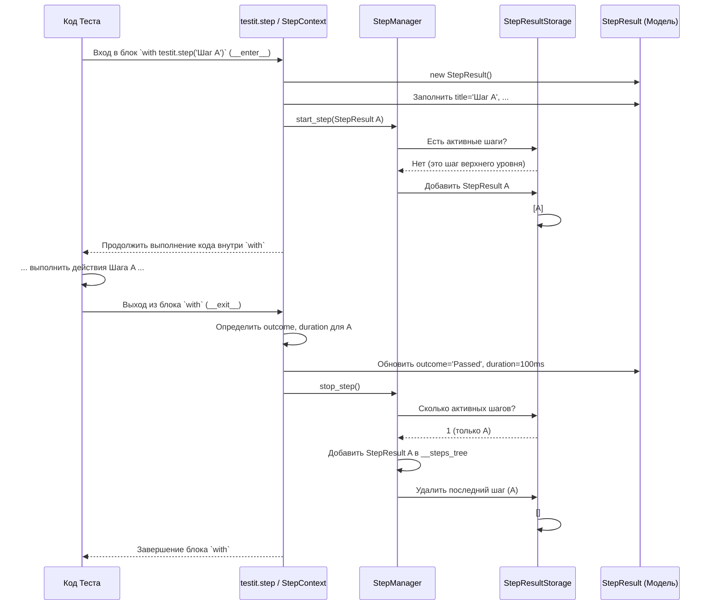

# Chapter 5: Менеджер Шагов (StepManager) и Контекст Шага (step)


В [предыдущей главе (Модели Данных)](04_модели_данных__testresult__stepresult__link_и_др___.md) мы узнали, что адаптер использует стандартизированные "бланки" (`TestResult`, `StepResult`, `Link`) для хранения информации о тестах перед отправкой в Test IT. Мы видели, что у `TestResult` есть поле `__step_results` для хранения информации о шагах внутри теста. Но как именно адаптер отслеживает эти шаги во время выполнения теста?

Представьте, что ваш автотест — это длинный и сложный рецепт. Если что-то пойдет не так, и блюдо не получится, просто сказать "Рецепт не сработал" — не очень полезно. Гораздо лучше знать, на каком именно этапе возникла проблема: "Шаг 1: Подготовка ингредиентов — Успешно", "Шаг 2: Смешивание — Успешно", "Шаг 3: Выпекание — Ошибка!". Вот такая детализация помогает быстро найти и исправить ошибку.

В мире автотестов ту же роль играют **шаги** (steps). Они позволяют разбить сложный тест на более мелкие, логически завершенные части. Когда вы смотрите отчет в Test IT, вы видите не только общий результат (прошел/упал), но и подробную структуру выполнения теста с результатами каждого шага.

За создание этой структуры и отслеживание шагов в `adapters-python` отвечают два компонента: **Менеджер Шагов (`StepManager`)** и инструмент для разметки шагов — **`testit.step`**. Давайте разберемся, как они работают вместе.

## Как разметить шаги в тесте? Используем `testit.step`

Чтобы сообщить адаптеру, где в вашем коде начинаются и заканчиваются логические шаги, вы используете специальный инструмент `testit.step`. Есть два основных способа его применения:

1.  **Контекстный менеджер (`with testit.step(...)`)**: Идеально подходит для разметки блоков кода внутри функции вашего теста.
2.  **Декоратор (`@testit.step(...)`)**: Отлично подходит для превращения целой функции (например, вспомогательной) в отдельный шаг.

Давайте рассмотрим оба варианта.

### 1. Контекстный менеджер `with testit.step(...)`

Это самый распространенный способ. Вы просто оборачиваете нужный блок кода в конструкцию `with`.

**Пример:** Представим тест входа на сайт.

```python
import pytest
import testit

@testit.externalId('login-test-with-steps')
def test_login_workflow():
    # Начинается первый шаг
    with testit.step('Ввод логина и пароля'):
        print("Вводим логин пользователя...")
        # username_field.send_keys('tester') # Пример действия
        print("Вводим пароль...")
        # password_field.send_keys('pass123') # Пример действия
        assert True # Шаг пока успешен

    # Начинается второй шаг
    with testit.step('Нажатие кнопки "Войти"'):
        print("Нажимаем кнопку входа...")
        # login_button.click() # Пример действия
        # Допустим, здесь произошла ошибка
        assert False, "Кнопка 'Войти' не найдена!"

    # Этот шаг не будет выполнен, так как предыдущий упал
    with testit.step('Проверка имени пользователя в профиле'):
        print("Проверяем имя пользователя...")
        # profile_name = get_profile_name() # Пример действия
        # assert profile_name == 'tester'
```

**Объяснение:**
*   Мы импортировали `testit`.
*   Каждый блок `with testit.step('Название шага'):` определяет один шаг.
*   Адаптер автоматически зафиксирует:
    *   **Начало** шага, когда код входит в блок `with`.
    *   **Название** шага ('Ввод логина и пароля', 'Нажатие кнопки "Войти"').
    *   **Завершение** шага, когда код выходит из блока `with`.
    *   **Статус** шага: 'Passed', если блок выполнился без ошибок, 'Failed', если внутри возникло исключение (ошибка).
    *   **Длительность** выполнения шага.
*   В Test IT вы увидите иерархию:
    ```
    Test: test_login_workflow (Failed)
    ├── Step: Ввод логина и пароля (Passed)
    └── Step: Нажатие кнопки "Войти" (Failed)
        └── Ошибка: AssertionError: Кнопка 'Войти' не найдена!
    ```

**Вложенные шаги:** Вы можете легко создавать иерархию, вкладывая `with` друг в друга.

```python
import pytest
import testit
import time

@testit.externalId('nested-steps-test')
def test_complex_operation():
    with testit.step('Шаг 1: Настройка'):
        print("Настраиваем окружение...")
        time.sleep(0.1) # Имитация работы

        with testit.step('Шаг 1.1: Загрузка данных'):
            print("Загружаем исходные данные...")
            time.sleep(0.2)
            assert True

        with testit.step('Шаг 1.2: Подготовка ресурсов'):
            print("Подготавливаем ресурсы...")
            time.sleep(0.1)
            # Представим, что здесь ошибка
            assert False, "Ресурс недоступен"

    # Этот шаг не выполнится
    with testit.step('Шаг 2: Выполнение операции'):
        print("Выполняем основную операцию...")
```

В Test IT это будет выглядеть так:
```
Test: test_complex_operation (Failed)
└── Step: Шаг 1: Настройка (Failed)
    ├── Step: Шаг 1.1: Загрузка данных (Passed)
    └── Step: Шаг 1.2: Подготовка ресурсов (Failed)
        └── Ошибка: AssertionError: Ресурс недоступен
```
Адаптер автоматически отслеживает эту вложенность.

### 2. Декоратор `@testit.step`

Если у вас есть вспомогательная функция, которая выполняет определенное логическое действие, вы можете превратить вызов этой функции в шаг с помощью декоратора `@testit.step`.

**Пример:**

```python
import pytest
import testit

# Помечаем функцию как шаг
@testit.step('Выполнение входа пользователя')
def perform_login(username, password):
    print(f"Попытка входа с {username}/{password}")
    # Здесь могла бы быть реальная логика WebDriver
    if username == 'tester' and password == 'pass123':
        print("Успешный вход!")
        return True
    else:
        print("Неверные данные!")
        # Вызываем ошибку, чтобы шаг упал
        raise ValueError("Неверный логин или пароль")

@testit.step
def check_profile_name(expected_name):
    # Если название шага не указано в декораторе, используется имя функции
    print(f"Проверка имени профиля, ожидается: {expected_name}")
    # profile_name = driver.find_element(...).text # Реальный код
    profile_name = "tester" # Имитация
    assert profile_name == expected_name

@testit.externalId('login-test-decorated-steps')
def test_login_with_decorated_functions():
    # Вызов функции perform_login будет обернут в шаг
    login_successful = perform_login('tester', 'pass123')

    # Вызов функции check_profile_name будет обернут в шаг
    if login_successful:
        check_profile_name('tester')

    # Пример вызова с ошибкой
    try:
        perform_login('wrong_user', 'wrong_pass')
    except ValueError as e:
        print(f"Поймали ожидаемую ошибку: {e}")
        # Тест продолжится, но шаг perform_login будет Failed в отчете

    # Этот шаг выполнится успешно
    check_profile_name('tester')
```

**Объяснение:**
*   Мы пометили функции `perform_login` и `check_profile_name` декоратором `@testit.step`.
*   Когда тест вызывает `perform_login('tester', 'pass123')`, адаптер автоматически:
    *   Начинает шаг с названием 'Выполнение входа пользователя'.
    *   Выполняет код внутри `perform_login`.
    *   Завершает шаг, фиксируя его статус (Passed или Failed, в зависимости от того, было ли исключение) и длительность.
*   Для `check_profile_name` мы не указали название в декораторе, поэтому адаптер использует имя функции: 'check_profile_name'.
*   Декоратор также захватывает аргументы функции и может отображать их как параметры шага в Test IT.

**Вложенные вызовы декорированных функций:** Если одна функция, помеченная `@testit.step`, вызывает другую функцию, также помеченную `@testit.step`, адаптер создаст правильную иерархию шагов.

```python
import pytest
import testit
import time

@testit.step("Вспомогательное действие {index}") # Можно использовать параметры в названии
def helper_action(index):
    print(f"Выполняем действие {index}")
    time.sleep(0.1 * index)
    assert index != 2 # Имитируем ошибку на втором действии

@testit.step # Используем имя функции как название шага: main_operation
def main_operation():
    print("Запуск основной операции")
    helper_action(1) # Вызов 1 - будет вложенным шагом
    helper_action(2) # Вызов 2 - упадет и уронит родительский шаг
    helper_action(3) # Не выполнится

@testit.externalId('nested-decorated-steps')
def test_decorated_hierarchy():
    try:
        main_operation() # Вызов создаст шаг "main_operation"
    except AssertionError as e:
        print(f"Поймали ошибку из helper_action: {e}")
```

Результат в Test IT:
```
Test: test_decorated_hierarchy (Failed)
└── Step: main_operation (Failed)
    ├── Step: Вспомогательное действие 1 (Passed)
    └── Step: Вспомогательное действие 2 (Failed)
        └── Ошибка: AssertionError
```

## Как хранятся результаты шагов?

Каждый раз, когда `testit.step` (через контекстный менеджер или декоратор) завершает шаг, он собирает всю информацию (название, статус, длительность, вложенные шаги, ошибки) и упаковывает ее в объект модели [**`StepResult`**](04_модели_данных__testresult__stepresult__link_и_др___.md).

Эти объекты `StepResult` затем добавляются в нужный список:
*   Если это шаг верхнего уровня, он добавляется в список `__step_results` основного объекта [`TestResult`](04_модели_данных__testresult__stepresult__link_и_др___.md).
*   Если это вложенный шаг, он добавляется в список `__step_results` родительского объекта `StepResult`.

За эту организацию и управление объектами `StepResult` отвечает **`StepManager`**.

## Как это работает "под капотом"? Менеджер Шагов (`StepManager`)

Давайте заглянем внутрь и посмотрим, как адаптер управляет шагами.

**Ключевые компоненты:**

1.  **`StepContext`** (реализация `testit.step`): Этот класс отвечает за логику контекстного менеджера (`__enter__`, `__exit__`) и декоратора (`__call__`). Именно он засекает время, определяет статус и взаимодействует со `StepManager`. Находится в `testit-python-commons/src/testit_python_commons/step.py`.

2.  **`StepManager`**: Центральный координатор шагов. Он знает, какой шаг выполняется сейчас, и поддерживает иерархию вложенных шагов. Использует вспомогательное хранилище для отслеживания текущего "пути" в дереве шагов. Находится в `testit-python-commons/src/testit_python_commons/services/step_manager.py`.

3.  **`StepResultStorage`**: Простое хранилище (по сути, стек), которое помогает `StepManager` отслеживать, какой шаг является текущим активным "родителем" для новых вложенных шагов. Находится в `testit-python-commons/src/testit_python_commons/services/step_result_storage.py`.

**Процесс работы `with testit.step(...)`:**

1.  **Начало `with`:** Выполняется метод `StepContext.__enter__`.
2.  **Создание `StepResult`:** `StepContext` создает пустой объект [`StepResult`](04_модели_данных__testresult__stepresult__link_и_др___.md), заполняет его названием, описанием и параметрами (если есть).
3.  **Сигнал `StepManager`:** `StepContext` вызывает `StepManager.start_step()`, передавая ему созданный `StepResult`.
4.  **`StepManager` обновляет иерархию:**
    *   `StepManager` смотрит в `StepResultStorage`: есть ли там уже активные шаги?
    *   **Если есть (это вложенный шаг):** Он берет последний шаг из `StepResultStorage` (это родительский шаг) и добавляет новый `StepResult` в его список `__step_results`.
    *   **Если нет (это шаг верхнего уровня):** Ничего не добавляет (он будет добавлен в `TestResult` позже).
    *   В любом случае, `StepManager` добавляет новый `StepResult` в `StepResultStorage`, делая его текущим активным шагом.
5.  **Выполнение кода шага:** Выполняется код внутри блока `with`.
6.  **Конец `with`:** Выполняется метод `StepContext.__exit__`.
7.  **Определение статуса и длительности:** `StepContext` проверяет, были ли ошибки (`exc_type`), вычисляет длительность и обновляет поля `__outcome` и `__duration` у своего `StepResult`.
8.  **Сигнал `StepManager`:** `StepContext` вызывает `StepManager.stop_step()`.
9.  **`StepManager` обновляет иерархию:**
    *   `StepManager` проверяет, является ли текущий шаг (который завершается) шагом верхнего уровня (т.е. в `StepResultStorage` только он один).
    *   **Если да:** Он добавляет этот завершенный `StepResult` в специальный список `__steps_tree` внутри `StepManager`. Этот список потом будет забран [`AdapterManager`](06_менеджер_адаптера__adaptermanager__.md) и добавлен в главный [`TestResult`](04_модели_данных__testresult__stepresult__link_и_др___.md).
    *   **Если нет (это вложенный шаг):** Ничего особенного не делает, так как он уже прикреплен к родителю на шаге 4.
    *   В любом случае, `StepManager` удаляет завершенный `StepResult` из `StepResultStorage`.

**Диаграмма последовательности (упрощенно для `with`):**



### Немного кода

**`StepContext`: Начало и конец шага (`testit-python-commons/src/testit_python_commons/step.py`)**

```python
# testit-python-commons/src/testit_python_commons/step.py
from datetime import datetime
from testit_python_commons.models.step_result import StepResult
from testit_python_commons.services import TmsPluginManager, Utils
# ...

class StepContext:
    def __init__(self, title, description, parameters):
        self.__title = title
        self.__description = description
        self.__parameters = parameters
        # ...

    def __enter__(self): # Вызывается при входе в 'with'
        self.__start_time = round(datetime.utcnow().timestamp() * 1000)
        self.__step_result = StepResult() # Создаем модель шага

        # Заполняем данными (название, описание, параметры)
        self.__step_result\
            .set_title(self.__title)\
            .set_description(self.__description)\
            .set_parameters(Utils.exclude_self_parameter(self.__parameters))

        # Сообщаем менеджеру о начале шага
        TmsPluginManager.get_step_manager().start_step(self.__step_result)

    def __exit__(self, exc_type, exc_val, exc_tb): # Вызывается при выходе из 'with'
        # Определяем статус: Failed если была ошибка (exc_type), иначе Passed
        # (реальная логика чуть сложнее для поддержки pytest-check)
        outcome = 'Failed' if exc_type else 'Passed'
        duration = round(datetime.utcnow().timestamp() * 1000) - self.__start_time

        # Обновляем модель результатом и длительностью
        self.__step_result\
            .set_outcome(outcome)\
            .set_duration(duration)

        # Сообщаем менеджеру о завершении шага
        TmsPluginManager.get_step_manager().stop_step()

    # Метод __call__ реализует логику декоратора @testit.step,
    # он внутри себя использует __enter__ и __exit__
    def __call__(self, function: Func) -> Func:
        # ... (код декоратора)
        with StepContext(title, self.__description, parameters): # Использует тот же __enter__/__exit__
             return function(*args, **kwargs)
        # ...
```

**`StepManager`: Управление иерархией (`testit-python-commons/src/testit_python_commons/services/step_manager.py`)**

```python
# testit-python-commons/src/testit_python_commons/services/step_manager.py
import typing
from testit_python_commons.models.step_result import StepResult
from testit_python_commons.services.step_result_storage import StepResultStorage

class StepManager:
    # Список для хранения завершенных шагов верхнего уровня
    __steps_tree: typing.List[StepResult] = []

    def __init__(self):
        # Хранилище для отслеживания активных шагов (стек)
        self.__storage = StepResultStorage()

    def start_step(self, step: StepResult):
        # Если есть активные шаги в хранилище...
        if self.__storage.get_count():
            # ...берем последний (это родитель)
            parent_step: StepResult = self.__storage.get_last()
            # Добавляем текущий шаг как вложенный к родителю
            step_results_from_parent_step = parent_step.get_step_results()
            step_results_from_parent_step.append(step)
            parent_step.set_step_results(step_results_from_parent_step)

        # Добавляем текущий шаг в хранилище (он становится активным)
        self.__storage.add(step)

    def stop_step(self):
        # Если в хранилище остался только один шаг (т.е. завершается шаг верхнего уровня)...
        if self.__storage.get_count() == 1:
            # ...добавляем его в итоговое дерево шагов
            self.__steps_tree.append(self.__storage.get_last())

        # Удаляем завершенный шаг из хранилища активных шагов
        self.__storage.remove_last()

    def get_steps_tree(self) -> typing.List[StepResult]:
        # Возвращает собранное дерево шагов и очищает его для следующего теста
        steps_tree = self.__steps_tree.copy()
        self.__steps_tree.clear()
        return steps_tree

    # def get_active_step(self) -> StepResult: # Позволяет получить текущий активный шаг
    #     return self.__storage.get_last()
```

**`StepResultStorage`: Хранилище активных шагов (`testit-python-commons/src/testit_python_commons/services/step_result_storage.py`)**

```python
# testit-python-commons/src/testit_python_commons/services/step_result_storage.py
import typing
from testit_python_commons.models.step_result import StepResult

class StepResultStorage:
    # Простой список, работающий как стек (LIFO - Last In, First Out)
    __storage: typing.List[StepResult] = []

    def add(self, step_result: StepResult):
        # Добавляет шаг в конец списка (на вершину стека)
        self.__storage.append(step_result)

    def get_last(self):
        # Возвращает последний добавленный шаг (с вершины стека), не удаляя его
        if not self.__storage:
            return None
        return self.__storage[-1]

    def remove_last(self):
        # Удаляет последний добавленный шаг (с вершины стека)
        try:
            self.__storage.pop()
        except Exception:
            # Обработка ошибки, если хранилище пустое
            pass

    def get_count(self) -> int:
        # Возвращает количество шагов в хранилище (глубину вложенности)
        return len(self.__storage)
```

Таким образом, `StepContext` и `StepManager` слаженно работают вместе, чтобы точно отслеживать начало, конец, статус и вложенность каждого шага, создавая подробную структуру выполнения теста с помощью моделей [`StepResult`](04_модели_данных__testresult__stepresult__link_и_др___.md).

## Заключение

В этой главе мы погрузились в мир шагов в `adapters-python`. Мы узнали:
*   Зачем нужны шаги: для детализации хода выполнения теста в отчетах Test IT.
*   Как их создавать: с помощью контекстного менеджера `with testit.step(...)` и декоратора `@testit.step`.
*   Что шаги могут быть вложенными, создавая иерархическую структуру.
*   Что за кулисами работает **`StepManager`**, который отслеживает активные шаги и строит дерево результатов с помощью моделей [`StepResult`](04_модели_данных__testresult__stepresult__link_и_др___.md).
*   Как `StepContext` (реализация `testit.step`) взаимодействует со `StepManager` для фиксации событий шага.

Теперь вы можете делать ваши тесты более информативными, разбивая их на логические шаги. Это сильно упрощает анализ упавших тестов и понимание их работы.

Мы уже рассмотрели конфигурацию, пользовательский интерфейс, интеграцию с фреймворками, модели данных и управление шагами. Но кто же всем этим руководит? Кто собирает все результаты тестов и шагов воедино и решает, когда и как их отправить в Test IT? Об этом главный "дирижер" — [Менеджер Адаптера (AdapterManager)](06_менеджер_адаптера__adaptermanager__.md) — мы поговорим в следующей главе.

**Далее:** [Глава 6: Менеджер Адаптера (AdapterManager)](06_менеджер_адаптера__adaptermanager__.md)

---

Generated by [AI Codebase Knowledge Builder](https://github.com/The-Pocket/Tutorial-Codebase-Knowledge)