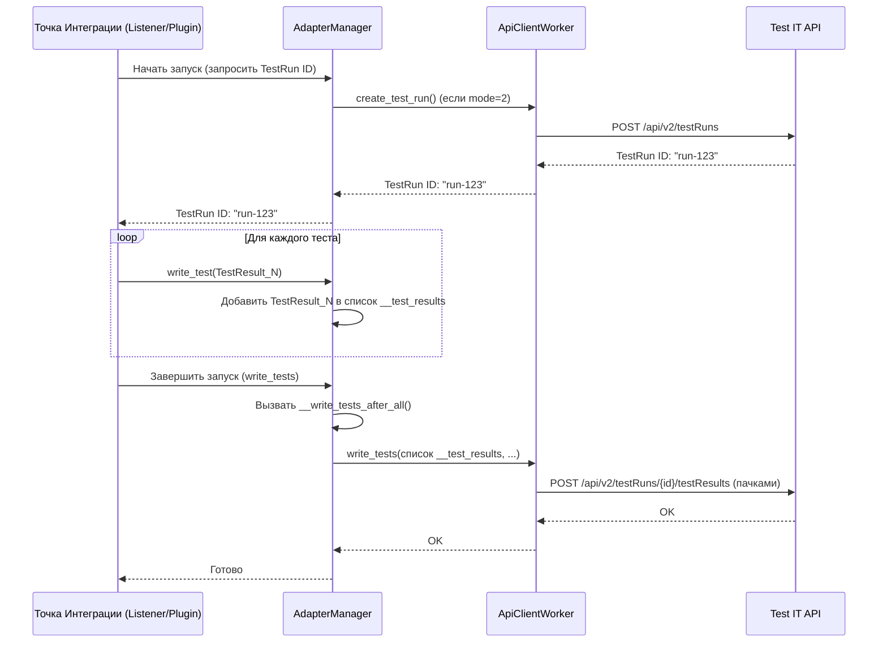

# Chapter 6: Менеджер Адаптера (AdapterManager)


В [предыдущей главе](05_менеджер_шагов__stepmanager__и_контекст_шага__step__.md) мы узнали, как `StepManager` помогает нам разбивать тесты на шаги и аккуратно собирает результаты каждого шага в объекты `StepResult`. Эти `StepResult` затем прикрепляются к главному "бланку" - объекту `TestResult` ([Глава 4: Модели Данных](04_модели_данных__testresult__stepresult__link_и_др___.md)).

Но кто отвечает за весь процесс целиком? Кто дирижирует всем этим оркестром? Кто решает, когда начать запись результатов, когда её закончить, кто собирает все `TestResult` вместе и, самое главное, кто даёт команду на отправку всего этого в Test IT?

Этим главным дирижером и является **Менеджер Адаптера (`AdapterManager`)**.

## Зачем нужен `AdapterManager`? Аналогия с Режиссером

Представьте, что ваш запуск тестов — это съемка фильма.
*   [Точки Интеграции](03_точки_интеграции_с_фреймворками__listeners_plugins_formatters__.md) (Listeners/Plugins/Formatters) — это операторы, которые снимают отдельные сцены (тесты).
*   [StepManager](05_менеджер_шагов__stepmanager__и_контекст_шага__step__.md) — это ассистент режиссера, который следит за дублями внутри сцены (шагами).
*   [Модели Данных](04_модели_данных__testresult__stepresult__link_и_др___.md) (`TestResult`, `StepResult`) — это кассеты с отснятым материалом.
*   [Клиент API (ApiClientWorker)](08_клиент_api__apiclientworker__.md) — это курьер, который отвозит кассеты на студию монтажа (Test IT API).

А **`AdapterManager` — это главный режиссер на съемочной площадке.** Он решает:
1.  **Когда начинать съемку:** Определяет, к какому тест-рану в Test IT будут относиться результаты. Если нужно, он дает команду "курьеру" (`ApiClientWorker`) создать новый тест-ран.
2.  **Какие сцены снимать:** В некоторых режимах работы он может получить из Test IT список конкретных тестов, которые нужно запустить (фильтрация).
3.  **Как обрабатывать отснятый материал:** Он получает "кассеты" (`TestResult`) от "операторов" (Listeners/Plugins), возможно, добавляет к ним информацию о подготовке и уборке площадки (фикстуры setup/teardown), и решает, как их хранить.
4.  **Когда отправлять на монтаж:** Он определяет, нужно ли отправлять каждую "кассету" (`TestResult`) сразу после съемки сцены (теста) или накопить все кассеты и отправить их разом в конце съемочного дня (запуска тестов).
5.  **Как общаться с курьером:** Он дает четкие указания "курьеру" (`ApiClientWorker`), что и когда загружать в Test IT (результаты тестов, прикрепленные файлы).

Без `AdapterManager` был бы хаос: операторы не знали бы, куда девать отснятый материал, курьер не знал бы, что и когда везти. `AdapterManager` связывает все компоненты воедино и управляет потоком данных от вашего тестового фреймворка до Test IT.

## Ключевые Задачи `AdapterManager`

Давайте подробнее рассмотрим, что делает наш "режиссер".

### 1. Управление Тест-Раном

Перед началом любого теста `AdapterManager` должен знать, в рамках какого **тест-рана** (Test Run) в Test IT будут сохраняться результаты. Эта информация берется из [конфигурации](01_загрузка_конфигурации__appproperties__.md) (`testRunId`, `adapterMode`).

*   **Если `adapterMode` = 0 или 1 (используем существующий тест-ран):** `AdapterManager` просто берет `testRunId` из конфигурации и передает его `ApiClientWorker`.
*   **Если `adapterMode` = 2 (создаем новый тест-ран):** `AdapterManager` просит `ApiClientWorker` создать новый тест-ран в Test IT. `ApiClientWorker` возвращает ID созданного тест-рана, и `AdapterManager` запоминает его для дальнейшего использования.

Этот шаг гарантирует, что все результаты окажутся в нужном месте в Test IT.

### 2. Фильтрация Тестов (Режим `adapterMode = 1`)

В режиме `adapterMode = 1`, Test IT может сам определить, какие автотесты должны быть запущены в рамках указанного тест-рана. В этом случае `AdapterManager` запрашивает у `ApiClientWorker` список `externalId` тестов, которые нужно выполнить (`get_autotests_for_launch`). Затем [Точки Интеграции](03_точки_интеграции_с_фреймворками__listeners_plugins_formatters__.md) могут использовать этот список, чтобы пропускать тесты, которых нет в списке от Test IT. (Это более продвинутый сценарий).

### 3. Сбор Результатов Тестов (`write_test`)

Это одна из главных задач. Когда [Точка Интеграции](03_точки_интеграции_с_фреймворками__listeners_plugins_formatters__.md) (Listener/Plugin/Formatter) фиксирует завершение теста, она формирует объект [TestResult](04_модели_данных__testresult__stepresult__link_и_др___.md), содержащий всю информацию (статус, шаги, ссылки, ошибки и т.д.), и передает его `AdapterManager`, вызывая метод `write_test(test_result)`.

Что дальше делает `AdapterManager` с этим `TestResult`, зависит от **режима загрузки**.

### 4. Управление Режимами Загрузки

В [конфигурации](01_загрузка_конфигурации__appproperties__.md) есть параметр `importRealtime` (или переменная окружения `TMS_IMPORT_REALTIME`), который определяет, как результаты будут отправляться в Test IT.

*   **Режим реального времени (`importRealtime = true`):**
    *   Как только `AdapterManager` получает `TestResult` через `write_test`, он **немедленно** передает его `ApiClientWorker` для отправки в Test IT (`__write_test_realtime` вызывает `ApiClientWorker.write_test`).
    *   **Плюс:** Результаты появляются в Test IT почти сразу после завершения теста.
    *   **Минус:** Может создавать большую нагрузку на сеть и API Test IT, если тесты выполняются очень быстро.
    *   **Примечание:** Информация о шагах фикстур (setup/teardown) загружается отдельно в конце всего запуска.

*   **Режим загрузки после всех тестов (`importRealtime = false`, по умолчанию):**
    *   `AdapterManager` **не отправляет** `TestResult` сразу. Он просто добавляет его во внутренний список (`self.__test_results`).
    *   Только **после завершения всех тестов**, когда вызывается метод `write_tests`, `AdapterManager` передает весь накопленный список `TestResult` объекту `ApiClientWorker` для отправки одной или несколькими большими "пачками" (`__write_tests_after_all` вызывает `ApiClientWorker.write_tests`).
    *   **Плюс:** Более эффективно с точки зрения сетевых запросов, меньше нагрузка на Test IT API.
    *   **Минус:** Результаты появляются в Test IT только после завершения всего тестового запуска.
    *   **Примечание:** Информация о шагах фикстур добавляется к `TestResult` перед отправкой.

`AdapterManager` сам решает, какой путь выбрать, основываясь на конфигурации.

### 5. Взаимодействие с `ApiClientWorker`

Важно понимать, что `AdapterManager` **не занимается** непосредственно отправкой данных по сети или обработкой ответов от Test IT API. Он **делегирует** эту работу [Клиенту API (ApiClientWorker)](08_клиент_api__apiclientworker__.md). `AdapterManager` говорит *что* сделать (создать тест-ран, загрузить результат, загрузить файл), а `ApiClientWorker` знает *как* это сделать (сформировать правильный HTTP-запрос, обработать ответ, обработать ошибки сети). Это разделение ответственности делает код более организованным.

### 6. Обработка Вложений

Если вы в тесте используете `testit.addAttachments('путь/к/файлу')`, этот вызов в конечном итоге доходит до `AdapterManager` через [TmsPluginManager](07_менеджер_плагинов_tms__tmspluginmanager__.md).
*   `AdapterManager` получает путь к файлу.
*   Он вызывает метод `load_attachments` у `ApiClientWorker`, передавая ему путь.
*   `ApiClientWorker` читает файл, отправляет его в Test IT API и возвращает `AdapterManager` уникальный ID загруженного файла.
*   `AdapterManager` (или вызывающий код) добавляет этот ID к текущему `TestResult` или `StepResult`.

`AdapterManager` также предоставляет метод `create_attachment` для создания вложения из текстовых данных.

## Как это работает "под капотом"?

`AdapterManager` — это класс, который инициализируется при старте адаптера (обычно через [TmsPluginManager](07_менеджер_плагинов_tms__tmspluginmanager__.md)). Он получает необходимые конфигурации и экземпляр `ApiClientWorker`.

**Типичный жизненный цикл (в режиме "загрузка после всех тестов"):**

1.  **Инициализация:** `AdapterManager` создается с `AdapterManagerConfiguration`, `ClientConfiguration` и `FixtureManager`. Создается `ApiClientWorker`.
2.  **Начало Запуска:** Компонент интеграции (Listener/Plugin) запрашивает ID тест-рана у `AdapterManager` (`get_test_run_id`).
3.  **`get_test_run_id`:**
    *   Проверяет `adapterMode`. Если 0 или 1, возвращает `testRunId` из конфигурации.
    *   Если 2, вызывает `self.__api_client.create_test_run()`, получает ID и возвращает его.
4.  **Выполнение Тестов:** Фреймворк запускает тесты один за другим.
5.  **Завершение Теста:** Listener/Plugin собирает данные в `TestResult` и вызывает `AdapterManager.write_test(test_result)`.
6.  **`write_test`:**
    *   Проверяет `should_import_realtime()`. В нашем случае это `false`.
    *   Добавляет `test_result` в список `self.__test_results`.
7.  **Динамическое Добавление Вложения (Пример):**
    *   Тест вызывает `testit.addAttachments(...)`.
    *   Вызов через `TmsPluginManager` доходит до `AdapterManager.load_attachments(...)`.
    *   `AdapterManager` вызывает `self.__api_client.load_attachments(...)`.
    *   `ApiClientWorker` загружает файл и возвращает ID.
    *   ID добавляется к текущему `TestResult`.
8.  **Все Тесты Завершены:** Listener/Plugin (или фреймворк) сигнализирует об окончании всего запуска, вызывая `AdapterManager.write_tests()`.
9.  **`write_tests`:**
    *   Проверяет `should_import_realtime()`. В нашем случае это `false`.
    *   Вызывает `self.__write_tests_after_all()`.
10. **`__write_tests_after_all`:**
    *   Получает информацию о фикстурах из `FixtureManager`.
    *   Возможно, добавляет шаги фикстур к соответствующим `TestResult` в списке `self.__test_results`.
    *   Вызывает `self.__api_client.write_tests(self.__test_results, fixtures)`, передавая накопленные результаты и фикстуры.
11. **`ApiClientWorker.write_tests`:** Отправляет данные в Test IT API (возможно, несколькими пачками).

**Диаграмма Последовательности (Режим "После Всех Тестов")**



### Немного Кода

Основная логика находится в файле `testit-python-commons/src/testit_python_commons/services/adapter_manager.py`.

**Инициализация:**

```python
# testit-python-commons/src/testit_python_commons/services/adapter_manager.py

from testit_python_commons.client.api_client import ApiClientWorker
from testit_python_commons.client.client_configuration import ClientConfiguration
from testit_python_commons.models.adapter_mode import AdapterMode
# ... другие импорты ...

class AdapterManager:
    def __init__(
            self,
            adapter_configuration: AdapterManagerConfiguration, # Конфигурация режимов
            client_configuration: ClientConfiguration,          # Конфигурация API клиента
            fixture_manager: FixtureManager):                 # Менеджер фикстур
        self.__config = adapter_configuration
        # Создаем "курьера" для общения с API
        self.__api_client = ApiClientWorker(client_configuration)
        self.__fixture_manager = fixture_manager
        self.__test_result_map = {} # Для режима реального времени
        self.__test_results = []    # Список для режима "после всех"
```
*   Конструктор получает объекты конфигурации и другие менеджеры (включая `ApiClientWorker`, который создается здесь же).
*   Инициализируются пустые хранилища для результатов.

**Получение ID Тест-Рана:**

```python
# testit-python-commons/src/testit_python_commons/services/adapter_manager.py

    @adapter_logger
    def get_test_run_id(self):
        # Если режим не "новый тест-ран", берем ID из конфига
        if self.__config.get_mode() != AdapterMode.NEW_TEST_RUN:
            return self.__config.get_test_run_id()

        # Иначе (mode == 2), просим API клиента создать новый
        return self.__api_client.create_test_run()
```
*   Простая логика выбора источника ID тест-рана.

**Обработка Результата Теста (`write_test`):**

```python
# testit-python-commons/src/testit_python_commons/services/adapter_manager.py

    @adapter_logger
    def write_test(self, test_result: TestResult):
        # Проверяем режим: отправлять сразу или копить?
        if self.__config.should_import_realtime():
            # Режим реального времени: вызываем приватный метод для немедленной отправки
            self.__write_test_realtime(test_result)
            return # Выходим

        # Режим "после всех": просто добавляем результат в список
        self.__test_results.append(test_result)

    @adapter_logger
    def __write_test_realtime(self, test_result: TestResult):
        # (Установка флага автосоздания...)
        test_result.set_automatic_creation_test_cases(
            self.__config.should_automatic_creation_test_cases())

        # Передаем результат "курьеру" для отправки
        # И сохраняем ID результата (возвращаемый API) для обновления фикстур позже
        self.__test_result_map[test_result.get_external_id()] = \
            self.__api_client.write_test(test_result)
```
*   `write_test` действует как диспетчер в зависимости от флага `should_import_realtime()`.
*   `__write_test_realtime` делегирует отправку `self.__api_client.write_test`.

**Завершение Запуска (`write_tests`):**

```python
# testit-python-commons/src/testit_python_commons/services/adapter_manager.py

    @adapter_logger
    def write_tests(self):
        # Если был режим реального времени...
        if self.__config.should_import_realtime():
            # ...то нужно отдельно загрузить результаты шагов фикстур
            self.__load_setup_and_teardown_step_results()
            return # Выходим

        # Если был режим "после всех", вызываем метод для отправки всего накопленного
        self.__write_tests_after_all()

    @adapter_logger
    def __load_setup_and_teardown_step_results(self):
        # Просим API клиента обновить результаты тестов, добавив шаги фикстур
        self.__api_client.update_test_results(
            self.__fixture_manager.get_all_items(), self.__test_result_map)

    @adapter_logger
    def __write_tests_after_all(self):
        # Получаем все фикстуры
        fixtures = self.__fixture_manager.get_all_items()

        # Передаем "курьеру" накопленные результаты и фикстуры для пакетной загрузки
        self.__api_client.write_tests(self.__test_results, fixtures)
```
*   `write_tests` также действует как диспетчер.
*   В режиме реального времени вызывается `__load_setup_and_teardown_step_results` для обновления уже загруженных результатов.
*   В режиме "после всех" вызывается `__write_tests_after_all`, который делегирует пакетную загрузку `self.__api_client.write_tests`.

**Загрузка Вложений:**

```python
# testit-python-commons/src/testit_python_commons/services/adapter_manager.py

    @adapter_logger
    def load_attachments(self, attach_paths: list or tuple):
        # Просто передаем пути файлов "курьеру"
        return self.__api_client.load_attachments(attach_paths)

    @adapter_logger
    def create_attachment(self, body, name: str):
        # (Логика создания временного файла из 'body' опущена)
        # ... создает временный файл 'path' ...

        # Передаем путь к временному файлу "курьеру"
        attachment_id = self.__api_client.load_attachments((path,))

        # (Логика удаления временного файла)
        # ... os.remove(path) ...

        return attachment_id # Возвращаем ID загруженного файла
```
*   Эти методы являются простыми посредниками, передающими запросы на загрузку файлов `ApiClientWorker`.

`AdapterManager` выступает как центральный узел, координирующий поток данных и вызовы других сервисов, но при этом не выполняющий самую "грязную" работу (как общение с API), а делегирующий её специализированным компонентам.

## Заключение

В этой главе мы познакомились с `AdapterManager` — главным "режиссером" или "дирижером" адаптера Test IT для Python. Мы узнали, что он:
*   Отвечает за управление тест-раном (использует существующий или командует создать новый).
*   Собирает готовые объекты `TestResult` от компонентов интеграции.
*   Управляет режимами отправки результатов: немедленно (realtime) или после всех тестов.
*   Дает команды `ApiClientWorker` на выполнение операций с API Test IT (загрузка результатов, файлов).
*   Является центральным координатором, но делегирует конкретную реализацию другим компонентам.

Понимание роли `AdapterManager` помогает увидеть общую картину работы адаптера: как информация проходит путь от тестового фреймворка до Test IT.

Но как различные части адаптера (Listeners, StepManager, AdapterManager) узнают друг о друге и получают доступ к общим ресурсам? За это отвечает еще один важный компонент — Менеджер Плагинов TMS (`TmsPluginManager`), который служит своего рода "диспетчерской" или "регистратурой" для всех этих сервисов. О нем мы поговорим в следующей главе.

**Далее:** [Глава 7: Менеджер Плагинов TMS (TmsPluginManager)](07_менеджер_плагинов_tms__tmspluginmanager__.md)

---

Generated by [AI Codebase Knowledge Builder](https://github.com/The-Pocket/Tutorial-Codebase-Knowledge)