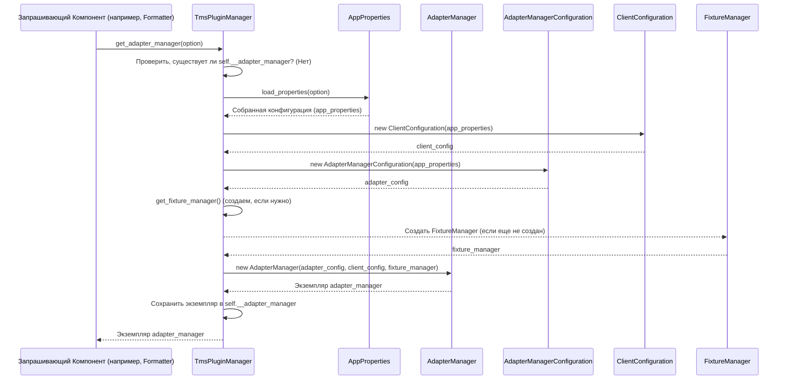

# Chapter 7: Менеджер Плагинов TMS (TmsPluginManager)


Добро пожаловать в седьмую главу нашего путешествия по `adapters-python`! В [предыдущей главе (Менеджер Адаптера)](06_менеджер_адаптера__adaptermanager__.md) мы познакомились с главным "режиссером" — `AdapterManager`, который управляет сбором и отправкой результатов тестов. Но как разные актеры на съемочной площадке (например, вспомогательная функция `testit.step` или "оператор"-Listener) находят этого режиссера или других важных специалистов, таких как [Менеджер Шагов (StepManager)](05_менеджер_шагов__stepmanager__и_контекст_шага__step__.md) или [Менеджер Адаптера (AdapterManager)](06_менеджер_адаптера__adaptermanager__.md)? Передавать ссылки на них каждому по отдельности было бы очень неудобно.

Представьте большой офис со множеством отделов и сотрудников. Как новому сотруднику (например, нашей функции `testit.addLinks`) узнать, к кому обратиться по вопросу отправки отчета ([AdapterManager](06_менеджер_адаптера__adaptermanager__.md)) или как зарегистрировать новый шаг задачи ([StepManager](05_менеджер_шагов__stepmanager__и_контекст_шага__step__.md))? Бегать по всему офису и спрашивать у каждого? Нет, для этого существует центральная **диспетчерская** или **регистратура**.

Именно эту роль в мире `adapters-python` выполняет **Менеджер Плагинов TMS (`TmsPluginManager`)**.

## Что такое `TmsPluginManager`? Диспетчерская Вышка

`TmsPluginManager` — это центральный **координационный центр** и **регистратура** для всех ключевых сервисов адаптера. Он знает, где найти:
*   [Менеджер Адаптера (`AdapterManager`)](06_менеджер_адаптера__adaptermanager__.md) — отвечает за тест-раны и отправку результатов.
*   [Менеджер Шагов (`StepManager`)](05_менеджер_шагов__stepmanager__и_контекст_шага__step__.md) — управляет созданием и иерархией шагов.
*   Менеджер Фикстур (`FixtureManager`) — следит за выполнением подготовительных и завершающих шагов (setup/teardown).
*   Логгер (`Logger`) — предоставляет стандартный механизм для логирования сообщений адаптера.
*   Систему "хуков" (`hook`) — механизм (основанный на библиотеке `pluggy`), позволяющий разным адаптерам (Pytest, Behave) подключать свою специфическую логику.

**Аналогия с диспетчерской вышкой:**
`TmsPluginManager` похож на диспетчерскую вышку в аэропорту. Пилоту (например, функции `testit.addAttachments`) не нужно знать точное местоположение каждой службы на земле. Ему достаточно связаться с диспетчерской (`TmsPluginManager`), запросить нужный сервис ("Мне нужен доступ к загрузке файлов", т.е. к `AdapterManager`), и диспетчерская направит его или предоставит нужную информацию/контакт.

**Основная задача `TmsPluginManager`:** Обеспечить **единую точку доступа** ко всем важным сервисам адаптера, гарантируя при этом, что для каждого сервиса существует **только один экземпляр** (это называется **Singleton**).

## Использование `TmsPluginManager`: Как получить доступ к сервисам?

Вам, как пользователю, обычно не нужно напрямую вызывать `TmsPluginManager`. Но важно понимать, как другие части адаптера его используют, чтобы получить то, что им нужно.

Когда какой-либо части кода адаптера требуется доступ, например, к `AdapterManager`, она просто обращается к `TmsPluginManager` с запросом.

**Пример 1: Как `testit.addLink` обращается к адаптеру?**

Вспомним функцию `testit.addLink` из [Главы 2](02_пользовательский_интерфейс__декораторы_теги_ключевые_слова__.md). Как она передает ссылку текущему адаптеру (Pytest, Behave и т.д.)? Она использует `TmsPluginManager`:

```python
# testit-python-commons/src/testit_python_commons/dynamic_methods.py (Упрощено)
from testit_python_commons.services import TmsPluginManager
from testit_python_commons.services.utils import Utils

def addLinks(url: str = None, ..., links: list or tuple = None):
    # 1. Проверяем, зарегистрировал ли текущий адаптер (Plugin/Formatter)
    #    специальный метод (хук) для добавления ссылок?
    if hasattr(TmsPluginManager.get_plugin_manager().hook, 'add_link'):
        if url:
            link_model = Utils.convert_link_dict_to_link_model({...}) # Создаем модель Link
            # 2. Вызываем хук 'add_link' через TmsPluginManager.
            #    TmsPluginManager перенаправит вызов к методу,
            #    зарегистрированному ТЕКУЩИМ адаптером (Pytest, Behave и т.д.)
            TmsPluginManager.get_plugin_manager().hook.add_link(link=link_model)
        elif links:
            # Обработка списка ссылок...
            for link_data in links:
                # ... (аналогично вызываем хук для каждой ссылки)
                pass
```
*   Функция `addLinks` не знает, какой именно адаптер сейчас работает (Pytest? Behave?).
*   Она обращается к `TmsPluginManager.get_plugin_manager().hook`. Диспетчер (`TmsPluginManager`) знает, какой плагин (адаптер) сейчас активен и какой метод (`add_link`) этот плагин зарегистрировал.
*   Вызов `hook.add_link(...)` передается активному плагину, который уже знает, как добавить ссылку к текущему результату теста (скорее всего, обратившись к `AdapterManager`).

**Пример 2: Как `testit.step` получает `StepManager`?**

Контекст `StepContext`, реализующий `testit.step` ([Глава 5](05_менеджер_шагов__stepmanager__и_контекст_шага__step__.md)), должен сообщить о начале и конце шага. Для этого ему нужен `StepManager`:

```python
# testit-python-commons/src/testit_python_commons/step.py (Упрощено)
from testit_python_commons.services import TmsPluginManager

class StepContext:
    # ... (код __init__)

    def __enter__(self):
        # ... (создаем объект StepResult)
        # Запрашиваем StepManager у диспетчера...
        step_manager = TmsPluginManager.get_step_manager()
        # ...и сообщаем ему о начале шага
        step_manager.start_step(self.__step_result)

    def __exit__(self, exc_type, exc_val, exc_tb):
        # ... (определяем статус, длительность)
        # Снова запрашиваем StepManager...
        step_manager = TmsPluginManager.get_step_manager()
        # ...и сообщаем ему о завершении шага
        step_manager.stop_step()
```
*   `StepContext` не создает `StepManager` сам. Он просто просит его у `TmsPluginManager.get_step_manager()`. `TmsPluginManager` вернет единственный существующий экземпляр `StepManager`.

**Пример 3: Как точка интеграции (Listener) получает `AdapterManager`?**

Компоненты, интегрирующиеся с фреймворками ([Глава 3](03_точки_интеграции_с_фреймворками__listeners_plugins_formatters__.md)), часто инициализируются в самом начале запуска тестов. Им нужен `AdapterManager` для работы.

```python
# testit-adapter-behave/src/testit_adapter_behave/formatter.py (Упрощено)
from behave.formatter.base import Formatter
from testit_python_commons.services import TmsPluginManager

class AdapterFormatter(Formatter):
    def __init__(self, stream_opener, config):
        super().__init__(stream_opener, config)
        # При создании форматтера запрашиваем AdapterManager
        # Передаем 'option' (конфигурация из Behave) для загрузки настроек
        adapter_manager = TmsPluginManager.get_adapter_manager(config.userdata)
        # Создаем Listener, передавая ему полученный adapter_manager
        self.__listener = AdapterListener(adapter_manager, ...)
        # ...
```
*   При инициализации `AdapterFormatter` вызывает `TmsPluginManager.get_adapter_manager()`. Если это первый вызов, `TmsPluginManager` создаст `AdapterManager` (загрузив конфигурацию через [`AppProperties`](01_appproperties__.md)), а затем вернет его. При последующих вызовах будет возвращаться тот же самый экземпляр.

Таким образом, `TmsPluginManager` действует как **фабрика** и **реестр** для основных сервисов, предоставляя к ним удобный и стандартизированный доступ из любой части адаптера.

## Как это работает "под капотом"? Ленивая Инициализация

Ключевая особенность `TmsPluginManager` — **ленивая инициализация** (lazy initialization). Это означает, что сервисы (как `AdapterManager`, `StepManager` и т.д.) создаются не сразу при старте программы, а только **в тот момент, когда они впервые запрашиваются**. При этом `TmsPluginManager` гарантирует, что для каждого сервиса будет создан **только один экземпляр** на протяжении всего времени работы программы.

**Процесс запроса сервиса (например, `get_adapter_manager`):**

1.  **Запрос:** Компонент (например, `AdapterFormatter`) вызывает `TmsPluginManager.get_adapter_manager()`.
2.  **Проверка:** `TmsPluginManager` смотрит внутрь себя: "У меня уже есть созданный `AdapterManager`?" (Проверяет значение своей внутренней переменной `__adapter_manager`).
3.  **Если Да:** `TmsPluginManager` немедленно возвращает ссылку на уже существующий экземпляр `AdapterManager`.
4.  **Если Нет (первый запрос):**
    *   `TmsPluginManager` понимает, что `AdapterManager` нужно создать.
    *   Он вызывает [`AppProperties.load_properties()`](01_appproperties__.md) для сбора всей конфигурации (из файла, переменных окружения, CLI).
    *   Он создает необходимые объекты конфигурации (`ClientConfiguration`, `AdapterManagerConfiguration`).
    *   Он (при необходимости) рекурсивно запрашивает и создает другие нужные менеджеры (например, `FixtureManager`, `Logger`).
    *   Он создает **новый** экземпляр `AdapterManager`, передавая ему все нужные конфигурации и менеджеры.
    *   Он сохраняет ссылку на этот новый экземпляр во внутренней переменной `__adapter_manager`.
    *   Он возвращает ссылку на только что созданный `AdapterManager`.

При всех последующих вызовах `get_adapter_manager` будет выполняться только шаг 3.

**Диаграмма Последовательности (Первый запрос `AdapterManager`)**



### Немного Кода

Логика `TmsPluginManager` находится в файле `testit-python-commons/src/testit_python_commons/services/plugin_manager.py`.

```python
# testit-python-commons/src/testit_python_commons/services/plugin_manager.py
import logging
from pluggy import PluginManager # От pluggy для хуков

from testit_python_commons.services.step_manager import StepManager
from testit_python_commons.app_properties import AppProperties

class TmsPluginManager:
    # Приватные переменные класса для хранения ЕДИНСТВЕННЫХ экземпляров
    __plugin_manager = None # От pluggy
    __adapter_manager = None
    __fixture_manager = None
    __step_manager = None
    __logger = None

    # Метод класса для получения менеджера плагинов pluggy
    @classmethod
    def get_plugin_manager(cls):
        if cls.__plugin_manager is None:
            cls.__plugin_manager = PluginManager('testit') # Создаем при первом запросе
        return cls.__plugin_manager

    # Метод класса для получения AdapterManager
    @classmethod
    def get_adapter_manager(cls, option=None):
        # Проверяем, создан ли уже экземпляр
        if cls.__adapter_manager is None:
            # Если нет, создаем (ленивая инициализация)
            # Динамически импортируем нужные классы, чтобы избежать циклических зависимостей
            from testit_python_commons.services.adapter_manager import AdapterManager
            from testit_python_commons.client.client_configuration import ClientConfiguration
            from testit_python_commons.services.adapter_manager_configuration import AdapterManagerConfiguration

            # Загружаем конфигурацию
            app_properties = AppProperties.load_properties(option)

            # Получаем/создаем логгер
            cls.get_logger(app_properties.get('logs') == 'true')

            # Создаем объекты конфигураций
            client_configuration = ClientConfiguration(app_properties)
            adapter_configuration = AdapterManagerConfiguration(app_properties)
            # Получаем/создаем FixtureManager
            fixture_manager = cls.get_fixture_manager()

            # Создаем единственный экземпляр AdapterManager
            cls.__adapter_manager = AdapterManager(
                adapter_configuration, client_configuration, fixture_manager)

        # Возвращаем существующий или только что созданный экземпляр
        return cls.__adapter_manager

    # Метод класса для получения FixtureManager (аналогичная логика)
    @classmethod
    def get_fixture_manager(cls):
        if cls.__fixture_manager is None:
            from testit_python_commons.services.fixture_manager import FixtureManager
            cls.__fixture_manager = FixtureManager()
        return cls.__fixture_manager

    # Метод класса для получения StepManager (аналогичная логика)
    @classmethod
    def get_step_manager(cls) -> StepManager:
        if cls.__step_manager is None:
            cls.__step_manager = StepManager()
        return cls.__step_manager

    # Метод класса для получения Logger (аналогичная логика)
    @classmethod
    def get_logger(cls, debug: bool = False):
        if cls.__logger is None:
            # Настройка логирования...
            cls.__logger = logging.getLogger('TmsLogger')
        return cls.__logger
```
*   **`@classmethod`**: Декоратор, который делает метод методом класса, а не экземпляра. Это позволяет вызывать `TmsPluginManager.get_adapter_manager()` без создания объекта `TmsPluginManager`.
*   **Приватные переменные класса (`__adapter_manager`, `__step_manager` и т.д.)**: Хранят ссылки на единственные экземпляры сервисов. Они инициализируются как `None`.
*   **Проверка `is None`**: Перед возвращением сервиса всегда проверяется, не равен ли он `None`. Если равен, значит, сервис еще не создан, и запускается логика его инициализации.

### Роль Системы Хуков (`pluggy`)

Как упоминалось ранее, `TmsPluginManager` также управляет системой хуков (`hook`) с помощью библиотеки `pluggy`. Это позволяет создавать точки расширения.
*   **Определение хуков:** В `testit-python-commons` определяются точки расширения (например, `add_link`, `add_attachments`).
*   **Регистрация реализаций:** Конкретный адаптер (например, `testit-adapter-pytest`) при своей инициализации регистрирует *свои* функции, которые будут вызываться для этих хуков. Он сообщает `TmsPluginManager`: "Вот моя функция для `add_link`!".
*   **Вызов хука:** Когда общий код (например, `dynamic_methods.addLinks`) вызывает `TmsPluginManager.get_plugin_manager().hook.add_link(...)`, `TmsPluginManager` (с помощью `pluggy`) находит и вызывает ту функцию, которую зарегистрировал *текущий активный* адаптер.

Это делает базовый код (`testit-python-commons`) независимым от конкретного фреймворка тестирования, а адаптер для фреймворка (например, `testit-adapter-pytest`) предоставляет специфичную для него реализацию.

## Заключение

В этой главе мы познакомились с `TmsPluginManager`, незаметным, но очень важным компонентом `adapters-python`. Мы узнали, что он:
*   Работает как **центральная диспетчерская** или **регистратура** для всех ключевых сервисов адаптера ([`AdapterManager`](06_менеджер_адаптера__adaptermanager__.md), [`StepManager`](05_менеджер_шагов__stepmanager__и_контекст_шага__step__.md) и др.).
*   Предоставляет **единую точку доступа** к этим сервисам (`TmsPluginManager.get_adapter_manager()`, `TmsPluginManager.get_step_manager()` и т.д.).
*   Гарантирует, что для каждого сервиса существует **только один экземпляр** (Singleton).
*   Использует **ленивую инициализацию**, создавая сервисы только при первом запросе.
*   Управляет системой **хуков (`pluggy`)**, позволяя разным адаптерам подключать свою специфическую логику.

Теперь мы понимаем, как различные части адаптера находят друг друга и получают доступ к общим ресурсам, сохраняя при этом порядок и слаженность работы всей системы.

Мы рассмотрели почти все основные компоненты. Остался последний важный элемент — тот, кто непосредственно общается с сервером Test IT, отправляет данные и получает ответы. Это [Клиент API (ApiClientWorker)](08_клиент_api__apiclientworker__.md), о котором мы и поговорим в заключительной главе нашего руководства.

**Далее:** [Глава 8: Клиент API (ApiClientWorker)](08_клиент_api__apiclientworker__.md)

---

Generated by [AI Codebase Knowledge Builder](https://github.com/The-Pocket/Tutorial-Codebase-Knowledge)