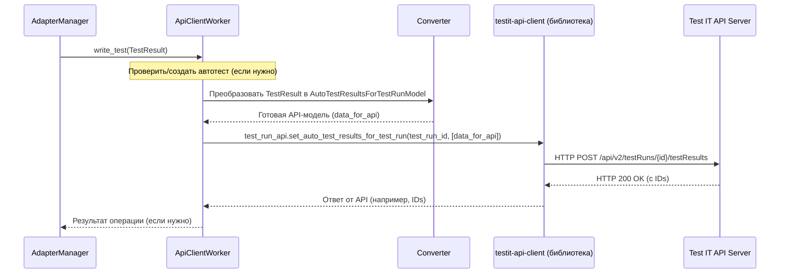

# Chapter 8: Клиент API (ApiClientWorker)


Добро пожаловать в заключительную главу нашего руководства по `adapters-python`! В [предыдущей главе](07_менеджер_плагинов_tms__tmspluginmanager__.md) мы разобрались, как `TmsPluginManager` работает в качестве центральной "диспетчерской", связывая все сервисы адаптера вместе. Мы видели, как [Менеджер Адаптера (AdapterManager)](06_менеджер_адаптера__adaptermanager__.md) собирает результаты тестов и управляет процессом их отправки. Но кто же выполняет саму "доставку"? Кто берет готовые данные и фактически отправляет их по сети на сервер Test IT?

За эту финальную и очень важную задачу отвечает **Клиент API (`ApiClientWorker`)**.

## Зачем нужен `ApiClientWorker`? Наш "Курьер" для Test IT

Представьте, что [менеджер адаптера (AdapterManager)](06_менеджер_адаптера__adaptermanager__.md) — это начальник отдела логистики. Он собрал все посылки (результаты тестов, файлы логов, скриншоты), правильно их упаковал и подготовил к отправке. Но ему нужен надежный **курьер**, который знает:
*   **Куда** доставить посылку (адрес вашего сервера Test IT).
*   **Как** ее доставить (используя специальный протокол — API Test IT).
*   **С каким ключом** войти в здание получателя (используя ваш API-токен).

Этим "курьером" и является `ApiClientWorker`. Он берет подготовленные [менеджером адаптера (AdapterManager)](06_менеджер_адаптера__adaptermanager__.md) данные (объекты [TestResult](04_модели_данных__testresult__stepresult__link_и_др___.md), пути к файлам вложений) и отвечает за их фактическую передачу в систему Test IT через её **API** (Интерфейс прикладного программирования). API — это как специальный "язык" или набор правил, который позволяет программам общаться друг с другом по сети.

`ApiClientWorker` также умеет "забирать" информацию с сервера, например, список тестов, которые нужно запустить (`adapterMode = 1`), но его основная работа — отправка ваших результатов.

**Проще говоря, `ApiClientWorker` — это мост между вашим кодом и сервером Test IT.**

## Ключевые задачи `ApiClientWorker`

Наш "курьер" умеет выполнять несколько важных операций:

1.  **Отправка Результатов Тестов:** Принимает от [AdapterManager](06_менеджер_адаптера__adaptermanager__.md) один или несколько объектов [TestResult](04_модели_данных__testresult__stepresult__link_и_др___.md), преобразует их в формат, понятный API Test IT, и отправляет на сервер.
2.  **Загрузка Вложений:** Принимает пути к файлам (логи, скриншоты и т.д.) от [AdapterManager](06_менеджер_адаптера__adaptermanager__.md), читает эти файлы и загружает их на сервер Test IT, получая взамен уникальный ID для каждого файла.
3.  **Создание и Обновление Автотестов:** Перед отправкой результатов, `ApiClientWorker` проверяет, существует ли автотест с указанным `externalId` в Test IT. Если нет, он может создать его (если разрешено настройками). Если существует, он может обновить его метаданные (имя, шаги, ссылки и т.д.).
4.  **Управление Тест-Раном:** По команде [AdapterManager](06_менеджер_адаптера__adaptermanager__.md) может создать новый тест-ран на сервере Test IT (`adapterMode = 2`).
5.  **Получение Списка Тестов:** По команде [AdapterManager](06_менеджер_адаптера__adaptermanager__.md) может запросить у Test IT список `externalId` тестов, которые нужно выполнить для конкретного тест-рана (`adapterMode = 1`).
6.  **Обработка Ошибок:** Если во время связи с сервером что-то пошло не так (нет сети, неверный токен, ошибка сервера), `ApiClientWorker` обрабатывает эти ситуации (например, логирует ошибку или пытается повторить запрос).

## Как мы используем `ApiClientWorker`? (Спойлер: почти никогда напрямую!)

Важно понимать: как пользователь адаптера, вы почти **никогда не будете вызывать методы `ApiClientWorker` напрямую** из своих тестов. Это внутренняя деталь реализации.

Всю работу по взаимодействию с `ApiClientWorker` берет на себя [Менеджер Адаптера (AdapterManager)](06_менеджер_адаптера__adaptermanager__.md).

**Пример:**
1.  Вы из теста вызываете `testit.addAttachments('screenshot.png')`.
2.  Этот вызов доходит до [AdapterManager](06_менеджер_адаптера__adaptermanager__.md).
3.  **`AdapterManager`** вызывает метод `load_attachments` у **`ApiClientWorker`**, передавая ему 'screenshot.png'.
4.  **`ApiClientWorker`** выполняет всю работу по загрузке файла на сервер Test IT и возвращает ID файла.
5.  `AdapterManager` получает ID и добавляет его к текущему результату теста.

Вы просто просите добавить вложение, а `AdapterManager` и `ApiClientWorker` сами разбираются, как это сделать.

## Как это работает "под капотом"? За кулисами у "Курьера"

Давайте немного заглянем внутрь `ApiClientWorker`, чтобы понять основные шаги его работы.

**Основные компоненты взаимодействия:**

1.  **`ApiClientWorker`:** Наш "курьер". Он знает адрес сервера (`url`) и секретный ключ (`privateToken`) из [конфигурации](01_appproperties__.md).
2.  **`ClientConfiguration`:** Объект, хранящий настройки для `ApiClientWorker` (URL, токен, ID проекта, ID конфигурации и т.д.).
3.  **`testit-api-client` (библиотека):** Специальная библиотека, которая содержит "готовые" функции для всех возможных запросов к API Test IT. `ApiClientWorker` использует эту библиотеку, чтобы не писать HTTP-запросы вручную. Внутри этой библиотеки есть классы вроде `TestRunsApi`, `AttachmentsApi` и т.д.
4.  **`Converter`:** Вспомогательный класс ([Глава 4: Модели Данных](04_модели_данных__testresult__stepresult__link_и_др___.md)), который переводит наши внутренние модели данных (`TestResult`, `StepResult`) в модели, понятные библиотеке `testit-api-client` и, соответственно, API Test IT. Работает как "переводчик".
5.  **Test IT API:** Собственно, сам сервер Test IT, который принимает запросы и отправляет ответы.

**Процесс отправки результата теста (упрощенно):**

1.  **Команда от `AdapterManager`:** [AdapterManager](06_менеджер_адаптера__adaptermanager__.md) вызывает `ApiClientWorker.write_test(test_result)` или `ApiClientWorker.write_tests([test_result_1, test_result_2, ...])`, передавая подготовленный(е) [TestResult](04_модели_данных__testresult__stepresult__link_и_др___.md).
2.  **Проверка/Создание Автотеста:** `ApiClientWorker` сначала проверяет, существует ли автотест с `external_id` из `test_result` в Test IT. Если нет, он создает его (используя `Converter` для преобразования `test_result` в `AutoTestPostModel` и вызывая `__autotest_api.create_auto_test`). Если есть, может обновить (используя `Converter` и `__autotest_api.update_auto_test`).
3.  **Преобразование данных:** `ApiClientWorker` использует `Converter.test_result_to_testrun_result_post_model(test_result, configuration_id)`, чтобы "перевести" наш внутренний объект `TestResult` в формат `AutoTestResultsForTestRunModel`, который понимает API Test IT для загрузки результатов.
4.  **Отправка запроса:** `ApiClientWorker` использует готовый метод из библиотеки `testit-api-client` (например, `__test_run_api.set_auto_test_results_for_test_run(...)`), передавая ему преобразованные данные и ID текущего тест-рана. Эта библиотека формирует правильный HTTP-запрос (метод POST, нужный URL, заголовки с токеном, тело запроса с данными) и отправляет его на сервер Test IT.
5.  **Получение ответа:** Сервер Test IT обрабатывает запрос и возвращает ответ (например, ID созданных результатов теста). Библиотека `testit-api-client` получает этот ответ.
6.  **Возврат результата (если нужно):** `ApiClientWorker` может вернуть некоторую информацию обратно [AdapterManager](06_менеджер_адаптера__adaptermanager__.md) (например, ID загруженного результата, чтобы связать его с фикстурами в режиме реального времени).

**Диаграмма Последовательности (Отправка одного результата):**



### Немного кода

Давайте посмотрим на ключевые части кода `ApiClientWorker`. Основная логика находится в `testit-python-commons/src/testit_python_commons/client/api_client.py`.

**Инициализация (`__init__`):**

```python
# testit-python-commons/src/testit_python_commons/client/api_client.py
import logging # Используется для логирования
from testit_api_client import ApiClient, Configuration
from testit_api_client.api import AttachmentsApi, AutoTestsApi, TestRunsApi, TestResultsApi
# ... другие импорты ...
from .client_configuration import ClientConfiguration # Конфигурация
from .converter import Converter # Наш "переводчик"

class ApiClientWorker:
    def __init__(self, config: ClientConfiguration):
        # 1. Получаем базовую конфигурацию для API клиента (URL, SSL, прокси)
        api_client_config = self.__get_api_client_configuration(
            url=config.get_url(),
            verify_ssl=config.get_cert_validation() != 'false',
            proxy=config.get_proxy())

        # 2. Создаем сам API клиент, добавляя токен для авторизации
        api_client = self.__get_api_client(api_client_config, config.get_private_token())

        # 3. Инициализируем "помощников" для разных частей API Test IT
        #    Каждый "помощник" знает свои методы (создать тест-ран, загрузить файл и т.д.)
        self.__test_run_api = TestRunsApi(api_client=api_client)
        self.__autotest_api = AutoTestsApi(api_client=api_client)
        self.__attachments_api = AttachmentsApi(api_client=api_client)
        self.__test_results_api = TestResultsApi(api_client=api_client)
        # ... другие API ...
        self.__config = config # Сохраняем конфигурацию для дальнейшего использования
```
*   Конструктор получает объект `ClientConfiguration`, который содержит все необходимые настройки ([Глава 1](01_appproperties__.md)).
*   Он настраивает базовый `ApiClient` из библиотеки `testit-api-client`, указывая адрес сервера и токен в заголовке `Authorization`.
*   Затем он создает экземпляры для работы с конкретными частями API (тест-раны, автотесты, вложения), используя настроенный `ApiClient`.

**Отправка Результатов (`__load_test_result`, вызывается из `write_test` и `write_tests`):**

```python
# testit-python-commons/src/testit_python_commons/client/api_client.py

    @adapter_logger # Декоратор для логирования
    def __load_test_result(self, test_result: TestResult) -> str:
        # 1. Используем "переводчик" для конвертации нашего TestResult
        #    в модель, понятную API Test IT
        model = Converter.test_result_to_testrun_result_post_model(
            test_result,
            self.__config.get_configuration_id()) # Нужен ID конфигурации

        # 2. Вызываем метод API для установки результата в тест-ран
        response = self.__test_run_api.set_auto_test_results_for_test_run(
            id=self.__config.get_test_run_id(), # Нужен ID тест-рана
            auto_test_results_for_test_run_model=[model]) # Передаем список моделей

        logging.debug(f'Результат автотеста "{test_result.get_autotest_name()}" загружен...')

        # 3. Возвращаем ID загруженного результата (если нужно)
        return Converter.get_test_result_id_from_testrun_result_post_response(response)

    # Метод write_tests обрабатывает список результатов,
    # проверяет/создает/обновляет автотесты и затем
    # вызывает __load_test_results для пакетной загрузки
    # через __test_run_api.set_auto_test_results_for_test_run
```
*   Метод берет наш `TestResult`.
*   Преобразует его с помощью `Converter`.
*   Вызывает метод `set_auto_test_results_for_test_run` из `TestRunsApi` (часть `testit-api-client`), передавая ID тест-рана и список преобразованных результатов.
*   Логирует результат и может вернуть ID из ответа сервера.

**Загрузка Вложений (`load_attachments`):**

```python
# testit-python-commons/src/testit_python_commons/client/api_client.py
import os # Для работы с файлами
from testit_api_client.models import AttachmentPutModel # Модель для ответа

    @adapter_logger
    def load_attachments(self, attach_paths: list or tuple):
        attachments = [] # Список для хранения ID загруженных файлов

        for path in attach_paths:
            # Проверяем, что файл существует
            if os.path.isfile(path):
                # Открываем файл для чтения в бинарном режиме ('rb')
                with open(path, "rb") as file:
                    try:
                        # 1. Вызываем метод API для загрузки файла
                        #    Передаем кортеж (имя файла, содержимое файла)
                        attachment_response = self.__attachments_api.api_v2_attachments_post(
                            file=(os.path.basename(path), file.read())) # Читаем содержимое

                        # 2. Сохраняем ID загруженного файла
                        attachments.append(AttachmentPutModel(id=attachment_response.id))
                        logging.debug(f'Вложение "{path}" было загружено')
                    except Exception as exc:
                        # Обработка возможных ошибок при загрузке
                        logging.error(f'Ошибка загрузки вложения "{path}": {exc}')
            else:
                logging.error(f'Файл "{path}" не найден!')
        # Возвращаем список ID загруженных файлов
        return attachments
```
*   Метод итерирует по списку путей к файлам.
*   Для каждого файла он открывает его, читает содержимое.
*   Вызывает метод `api_v2_attachments_post` из `AttachmentsApi` (часть `testit-api-client`), который отправляет файл на сервер.
*   Сохраняет ID, возвращенный сервером.
*   Возвращает список всех полученных ID.

Таким образом, `ApiClientWorker` инкапсулирует всю сложность прямого взаимодействия с API Test IT, используя `testit-api-client` и `Converter`, и предоставляет простые методы для [AdapterManager](06_менеджер_адаптера__adaptermanager__.md).

## Заключение

В этой последней главе мы изучили `ApiClientWorker` — компонент, отвечающий за непосредственное общение с сервером Test IT. Мы узнали, что:
*   Он действует как "курьер", доставляя данные (результаты тестов, вложения) в Test IT и забирая информацию (списки тестов) оттуда.
*   Он использует библиотеку `testit-api-client` для выполнения HTTP-запросов к API Test IT.
*   Он использует `Converter` для "перевода" внутренних моделей данных в формат, понятный API.
*   Он знает адрес сервера и токен доступа из [конфигурации](01_appproperties__.md).
*   Пользователи адаптера обычно **не взаимодействуют** с ним напрямую; эту работу выполняет [AdapterManager](06_менеджер_адаптера__adaptermanager__.md).

Теперь у вас есть полное представление о том, как устроен `adapters-python` изнутри: от загрузки конфигурации и разметки тестов до сбора результатов, управления шагами и, наконец, отправки данных в Test IT с помощью `ApiClientWorker`.

Мы надеемся, что это пошаговое руководство помогло вам понять архитектуру и принципы работы адаптеров Test IT для Python. Вооружившись этими знаниями, вы сможете не только эффективно использовать адаптеры, но и лучше понимать, как они интегрируются с вашими тестовыми проектами.

**Что дальше?**
*   Изучите документацию по конкретному адаптеру для вашего фреймворка (Pytest, Behave, Robot Framework), чтобы узнать о специфичных для него возможностях.
*   Попробуйте настроить интеграцию в своем проекте, используя полученные знания.
*   Не бойтесь заглядывать в исходный код адаптеров — теперь вы знаете, где искать основные компоненты!

Спасибо, что прошли этот путь вместе с нами! Успешной интеграции ваших автотестов с Test IT!

---

Generated by [AI Codebase Knowledge Builder](https://github.com/The-Pocket/Tutorial-Codebase-Knowledge)