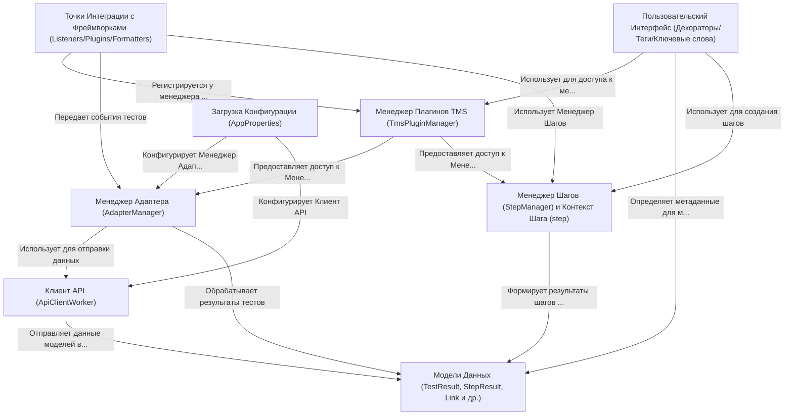

# Tutorial: adapters-python

Этот проект представляет собой набор **адаптеров** для различных *фреймворков тестирования* Python (таких как Pytest, Behave, Robot Framework).
Его основная цель - собирать информацию о ходе выполнения ваших автотестов (результаты, шаги, вложения, ссылки) и **отправлять** её в систему управления тестированием *Test IT TMS*.
Адаптер позволяет связать автоматические тесты с ручными тест-кейсами, получать детальные отчеты и управлять запусками тестов из Test IT.

**Source Repository:** [https://github.com/testit-tms/adapters-python](https://github.com/testit-tms/adapters-python)

## Chapters

1. [Загрузка Конфигурации (AppProperties)
](01_загрузка_конфигурации__appproperties__.md)
2. [Пользовательский Интерфейс (Декораторы/Теги/Ключевые слова)
](02_пользовательский_интерфейс__декораторы_теги_ключевые_слова__.md)
3. [Точки Интеграции с Фреймворками (Listeners/Plugins/Formatters)
](03_точки_интеграции_с_фреймворками__listeners_plugins_formatters__.md)
4. [Модели Данных (TestResult, StepResult, Link и др.)
](04_модели_данных__testresult__stepresult__link_и_др___.md)
5. [Менеджер Шагов (StepManager) и Контекст Шага (step)
](05_менеджер_шагов__stepmanager__и_контекст_шага__step__.md)
6. [Менеджер Адаптера (AdapterManager)
](06_менеджер_адаптера__adaptermanager__.md)
7. [Менеджер Плагинов TMS (TmsPluginManager)
](07_менеджер_плагинов_tms__tmspluginmanager__.md)
8. [Клиент API (ApiClientWorker)
](08_клиент_api__apiclientworker__.md)

---

Generated by [AI Codebase Knowledge Builder](https://github.com/The-Pocket/Tutorial-Codebase-Knowledge)