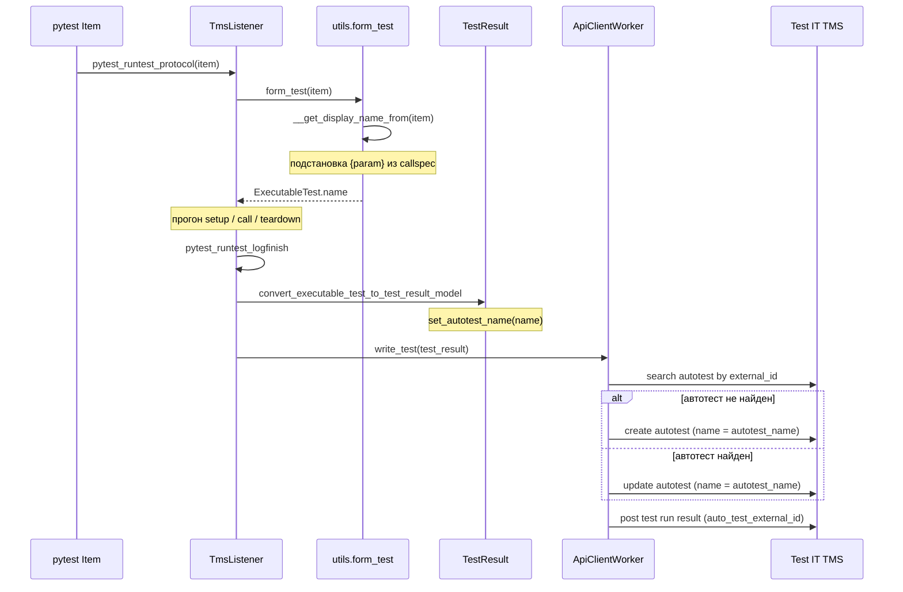

# Схема проставления `displayName` (pytest-адаптер)

Документ описывает **текущее** поведение адаптера: как значение из `@testit.displayName` попадает в прогон, что обновляется в карточке **автотеста** в TMS и что хранится в **тест-результате**.

---

## Термины в Test IT

| Понятие в адаптере | Декоратор / поле | Поле в API (автотест) | Где видно в TMS |
|---|---|---|---|
| Внутреннее имя автотеста | `@testit.displayName` → `test_displayname` | `name` в create/update autotest | Имя автотеста, связь с результатами прогона |
| Имя в карточке автотеста | `@testit.title` → `test_title` | `title` | Заголовок в карточке автотеста |
| Уникальный ключ автотеста | `@testit.externalId` → `test_external_id` | `external_id` | Идентификация одного автотеста в проекте |
| Параметры прогона | `item.callspec.params` | `parameters` в test run result | Параметры конкретного запуска |

**Важно:** `displayName` — это не отдельное поле тест-результата в API. Адаптер передаёт разрешённое имя в `TestResult.autotest_name`, а дальше оно уходит в **`name` автотеста** при create/update и косвенно связывается с результатом через `auto_test_external_id`.

---

## Общая схема (один запуск теста)



---

## Этап 1. Декоратор `@testit.displayName`

**Файл:** `testit_python_commons/decorators.py`

```python
@testit.displayName("{header}")
def test_1(...):
    ...
```

- На функцию (до обёрток `inner`) записывается атрибут **`function.test_displayname`** — строка-шаблон, например `"{header}"`.
- Декоратор возвращает обёртку `inner(function)` (sync/async wrapper), у которой через `@wraps` сохраняется цепочка `__wrapped__`; атрибут `test_displayname` остаётся на объектах в цепочке обёрток.

Шаблон **не подставляется** на этапе импорта модуля — только при формировании теста перед прогоном.

---

## Этап 2. Коллекция тестов (`pytest_collection_modifyitems`)

**Файл:** `testit_adapter_pytest/listener.py` → `__get_separation_of_tests`

На этом этапе для **каждого** `pytest.Item` вычисляется только **`item.test_external_id`** (для фильтрации в `adapterMode=0`):

| Условие | Значение `item.test_external_id` |
|---|---|
| Есть `@testit.externalId` на функции | Шаблон с подстановкой параметров |
| Нет декоратора | `sha256(parent.nodeid + function.__name__)` |

Для параметризованных тестов **без** `@testit.externalId` все варианты получают **один и тот же** `external_id` (имя функции и parent nodeid общие).

**`displayName` на этапе коллекции не вычисляется** и на `item` не сохраняется.

---

## Этап 3. Старт прогона теста (`pytest_runtest_protocol`)

**Файл:** `testit_adapter_pytest/listener.py`

```python
self.__executable_test = utils.form_test(item)
```

Вызывается **один раз на вариант** parametrized-теста, до `setup` / `call` / `teardown`.

### 3.1. `form_test(item)`

**Файл:** `testit_adapter_pytest/utils.py`

| Поле `ExecutableTest` | Источник |
|---|---|
| `name` | `__get_display_name_from(item)` ← **это и есть displayName** |
| `external_id` | `__get_external_id_from(item)` |
| `title` | `@testit.title` (если есть) |
| `parameters` | `item.callspec.params` (строками) |
| … | namespace, classname, links, … |

### 3.2. Разрешение `displayName`

**`__get_display_name_from(item)`:**

1. Ищет `test_displayname` через `__search_attribute(item, 'test_displayname')`:
   - сначала `item.function`
   - затем `item.cls`
   - **`item.test_displayname` не проверяется**
2. Если декоратора нет — fallback: docstring функции или `function.__name__`.
3. Если шаблон есть — `collect_parameters_in_string_attribute(template, get_all_parameters(item))`.

**`get_all_parameters(item)`:**

1. `item.test_properties` (если есть; заполняется обёрткой `inner` при первом запуске — ограниченно).
2. `item.callspec.params` — основной источник для `@pytest.mark.parametrize`.
3. Для dict-параметров ключи верхнего уровня «разворачиваются» в корень (`__expand_dict_parameters`).

**Подстановка плейсхолдеров** (`collect_parameters_in_string_attribute`):

- Ищет `{имя}` в шаблоне.
- Берёт значение из `get_parameter` / `callspec`.
- Заменяет в строке; при отсутствии ключа пишет error в лог, плейсхолдер остаётся.

**Пример:** `@testit.displayName("{header}")` + parametrization `header='3'` → `ExecutableTest.name == "3"`.

### 3.3. Разрешение `externalId` (связь с displayName)

**`__get_external_id_from(item)`** — та же схема поиска атрибута на `function` / `cls`:

| Условие | `external_id` |
|---|---|
| Нет `@testit.externalId` | `sha256(parent.nodeid + function.__name__)` — **общий для всех параметров** |
| Есть `@testit.externalId("{header}\|{whoIs}")` | Уникальный ID после подстановки |

**`item.test_external_id`**, посчитанный на коллекции, при `form_test` **не используется** (поиск только на function/cls).

---

## Этап 4. Во время выполнения теста

### Динамическое переименование

**`testit.addDisplayName(...)`** → hook `add_display_name` в listener:

```python
self.__executable_test.name = test_display_name
```

Перезаписывает имя **только для текущего** `ExecutableTest` до отправки в TMS.

### Параметры

`__get_parameters_from(item)` кладёт `callspec.params` в `TestResult.parameters` — это **параметры результата прогона**, не путать с подстановкой в `displayName`.

---

## Этап 5. Завершение теста (`pytest_runtest_logfinish`)

```python
self.__adapter_manager.write_test(
    utils.convert_executable_test_to_test_result_model(self.__executable_test)
)
```

**`convert_executable_test_to_test_result_model`:**

```python
TestResult()
    .set_external_id(executable_test.external_id)
    .set_autotest_name(executable_test.name)   # ← разрешённый displayName
    .set_title(executable_test.title)          # ← отдельное поле title
    ...
```

Имя из `displayName` попадает в **`autotest_name`**, не в `title`.

---

## Этап 6. Отправка в TMS (`ApiClientWorker.write_test`)

Зависит от `importRealtime` (по умолчанию в 4.x — `false`, буфер; при `true` — сразу после каждого теста). Логика **одинаковая** для одного теста.

### 6.1. Поиск автотеста

По `project_id` + `external_id` из `TestResult`.

### 6.2. Create или Update автотеста

| Операция | Модель API | Поле имени |
|---|---|---|
| Create | `CreateAutoTestRequest` / `AutoTestCreateApiModel` | `name=test_result.get_autotest_name()` |
| Update | `UpdateAutoTestRequest` / `AutoTestUpdateApiModel` | `name=test_result.get_autotest_name()` |

Также передаются: `title`, `namespace`, `classname`, `description`, `links`, `labels`, `tags`, шаги и т.д.

**Вывод: `displayName` при каждой отправке обновляет поле `name` автотеста в TMS** (create или update).

### 6.3. Создание тест-результата в прогоне

**`test_result_to_testrun_result_post_model`:**

- `auto_test_external_id` — связь с автотестом;
- статус, длительность, шаги, attachments, `parameters`, `links` (result links);
- **отдельного поля `displayName` / `name` в модели результата нет**.

В UI прогона имя результата обычно берётся из **текущего автотеста**, связанного по `external_id`.

---

## Меняется ли `displayName` в автотесте?

| Ситуация | Поведение |
|---|---|
| Один `external_id`, несколько parametrized-вариантов с разным `{header}` | Один автотест в TMS; при каждом `write_test` поле **`name` перезаписывается** последним прогнанным значением. В прогоне у всех результатов может отображаться **последнее** имя (например `8`). |
| У каждого варианта свой `@testit.externalId("{header}\|...")` | Несколько автотестов; у каждого своё `name` (`1`, `2`, `3`, …). |
| Повторные прогоны того же `external_id` | Update автотеста: `name` снова ставится из текущего разрешённого `displayName`. |
| Вызов `testit.addDisplayName` в теле теста | В TMS уйдёт переопределённое имя для этого запуска. |

**`title` (`@testit.title`)** обновляется отдельно и не подменяет `displayName`; если `title` не задан, в документации TMS для карточки может использоваться имя из `displayName` (логика на стороне TMS).

---

## Режимы отправки

| `importRealtime` | Когда вызывается `write_test` | Влияние на displayName |
|---|---|---|
| `true` | После каждого теста (`pytest_runtest_logfinish`) | Имя фиксируется на момент окончания этого теста; update автотеста сразу. |
| `false` | Буфер в `AdapterManager.__test_results`, массовая отправка в `pytest_sessionfinish` | Для каждого буферизованного теста своё `autotest_name` из момента `form_test`; порядок update автотестов в bulk — по порядку в списке. |

При включённом **Sync Storage** (не legacy workflow) возможна дополнительная ветка с отправкой статуса `InProgress` до финального результата; **`autotest_name` при этом не меняет схему** — финальная запись идёт через тот же `write_test` / bulk.

---

## Сводная таблица: что куда попадает

```
@testit.displayName("{header}")
        │
        ▼  pytest_runtest_protocol → form_test
        │
ExecutableTest.name = "3"
        │
        ▼  logfinish → TestResult.autotest_name
        │
        ├─► POST/PUT Autotest.name = "3"     (карточка автотеста, обновляется)
        │
        └─► POST TestRunResult
              auto_test_external_id = <external_id>
              (имя в модели результата нет; в UI — через автотест)
```

---

## Рекомендация для параметризованных тестов

Если нужны разные отображаемые имена (`1`, `2`, `3`, …) **одновременно** в одном прогоне:

```python
@testit.displayName("{header}")
@testit.externalId("{header}|{whoIs}")  # уникальный external_id обязателен
def test_1(fleet, whoIs, entities, header):
    ...
```

Без уникального `external_id` адаптер ведёт себя корректно с точки зрения кода, но в TMS все варианты — один автотест с перезаписываемым `name`.

---

## Связанные файлы в репозитории

| Файл | Роль |
|---|---|
| `testit_python_commons/decorators.py` | `@testit.displayName`, обёртка `inner` |
| `testit_adapter_pytest/listener.py` | хуки pytest, `form_test`, `write_test` |
| `testit_adapter_pytest/utils.py` | разрешение шаблонов, `form_test` |
| `testit_python_commons/services/adapter_manager.py` | realtime / bulk, sync storage |
| `testit_python_commons/client/api_client.py` | create/update autotest, post result |
| `testit_python_commons/client/converter.py` | маппинг в API-модели |
