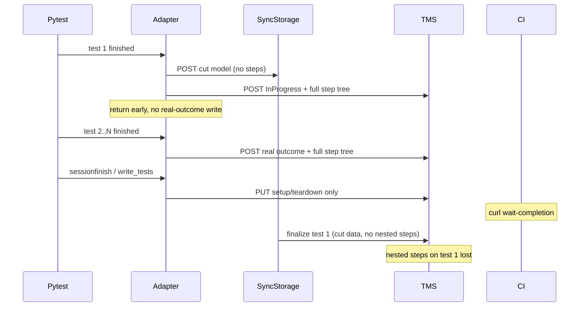

# Real-Time Import (`importRealtime=true`) Specification

This document describes how the Python adapter imports test results in real time and documents a known issue with nested test steps that appeared when the run finished.

## Overview

When `importRealtime=true` (CLI: `--testit-import-realtime`, config: `importrealtime`), each test result is sent to Test IT immediately after the test completes. At the end of the session, the adapter performs an additional update to attach fixture setup/teardown steps that were not available during the per-test upload.

When `importRealtime=false`, all test results are sent once after the session finishes (`write_tests_after_all`).

## Real-Time Flow

1. **Per test** (`pytest_runtest_logfinish` → `AdapterManager.write_test` → `ApiClientWorker.write_test`):
   - Autotest metadata is created or updated (including nested steps in the autotest model).
   - Test result is posted via `set_auto_test_results_for_test_run` with full nested `step_results` converted by `Converter.step_results_to_attachment_put_model_autotest_step_results_model`.

2. **After session** (`pytest_sessionfinish` → `AdapterManager.write_tests` → `ApiClientWorker.update_test_results`):
   - Only fixture setup/teardown steps are uploaded for tests that were already sent in real time.
   - Test result IDs are stored in `AdapterManager.__test_result_map` during the per-test upload.

## Bug: Nested Steps Disappear After Run Completion

### Symptoms

- Nested steps are visible on the **autotest** card (correct).
- Nested steps are visible on the **test result** while the run is still in progress.
- After the run completes, only **top-level** steps remain on the test result.
- Reproducible with `importRealtime=true` (default since adapter 4.x).
- Not reproducible with `importRealtime=false`.
- **With Sync Storage enabled:** only the **first** test in the run is affected (the one held as `InProgress`).
- Tests that are not the first one keep nested steps.
- Without Sync Storage the issue does not reproduce (for the adapter-only PUT bug below).

There are **two independent causes**; both can flatten nested steps on the test result.

---

### Cause A (adapter): final session PUT overwrote `step_results`

At session finish, `update_test_results` used to:

1. `GET` the test result from the API (`get_test_result_by_id`).
2. Build a PUT request from the GET response via `convert_test_result_model_to_test_results_id_put_request`.
3. Overwrite `setup_results` and `teardown_results` with fixture steps.
4. `PUT` the full model back, **including `step_results` from the GET response**.

The problem is a model mismatch:

| Operation | `step_results` model | Nested structure |
|-----------|---------------------|------------------|
| POST (create result) | `AttachmentPutModelAutoTestStepResultsModel` | Full tree via recursive `step_results` |
| GET (read result) | `StepResultApiModel` | References only (`step_id`, `outcome`, …) — **no nested `step_results`** |
| PUT (update result) | `StepResultApiModel` | Same flat reference list |

Re-sending `step_results` from GET in the final PUT replaced the full nested tree (written during real-time import) with a flat list of top-level step references. Autotest steps were unaffected because they are written on a separate API path during `write_test`.

### Fix

The final session update must **not** send `step_results`. It should only attach fixture setup/teardown steps.

**Before:**

```python
test_result_response = self.get_test_result_by_id(test_result.get_test_result_id())
model = Converter.convert_test_result_model_to_test_results_id_put_request(test_result_response)
model.setup_results = Converter.step_results_to_auto_test_step_result_update_request(...)
model.teardown_results = Converter.step_results_to_auto_test_step_result_update_request(...)
self.__test_results_api.api_v2_test_results_id_put(...)
```

**After:**

```python
model = Converter.convert_test_result_with_all_setup_and_teardown_steps_to_test_results_id_put_request(
    test_result)
self.__test_results_api.api_v2_test_results_id_put(...)
```

`convert_test_result_with_all_setup_and_teardown_steps_to_test_results_id_put_request` builds a PUT request with only:

- `setup_results` — recursive `AutoTestStepResultUpdateRequest` (nested fixture steps preserved)
- `teardown_results` — same

The `step_results` field is omitted, so the nested test steps written during real-time import are not overwritten.

---

### Cause B (Sync Storage + adapter): first test finalized without step tree

When Sync Storage is running and the worker is **master**, the **first** completed test takes a special path in `AdapterManager.__write_test_realtime` → `on_master_no_already_in_progress`:

1. Adapter sends **`TestResultCutApiModel`** to Sync Storage (`POST /in_progress_test_result`).
   - Payload contains only: `projectId`, `autoTestExternalId`, `statusCode`, `statusType`, `startedOn`.
   - **No `step_results`, no attachments, no nested data.**
2. Adapter sets outcome to `InProgress` and posts the test result to Test IT via `_write_test_realtime_internal`.
   - This POST **does** include the full nested `step_results` tree.
3. Method returns `True` — the test is **not** written again with the real outcome through the adapter.

All subsequent tests skip step 1–3 (Sync Storage `is_already_in_progress` flag is set) and go through normal `_write_test_realtime_internal` with the real outcome and full steps.

At the end of the run, CI (or tooling) typically calls:

```bash
curl http://127.0.0.1:49152/wait-completion?testRunId=...
```

Sync Storage then finalizes the held in-progress result and pushes the **real** status to Test IT. It only ever received the **cut** model, so the final TMS update cannot restore nested `step_results`. That explains the observed pattern:

| Scenario | Nested steps on test result |
|----------|----------------------------|
| First test + Sync Storage + `importRealtime=true` | Visible during run, **lost after** `wait-completion` |
| Later tests in the same run | OK (normal real-time path) |
| Without Sync Storage | OK (no finalize overwrite) |
| Single test only | Always the first → always broken with Sync Storage |



#### Recommended fixes (Cause B)

**Option 1 — adapter (preferred, no Sync Storage release required):**

After Sync Storage completion, re-send the full test result for the held test:

1. In `on_master_no_already_in_progress`, **store a copy** of `TestResult` with the real outcome and full `step_results` before mutating outcome to `InProgress`.
2. In `write_tests` (or after `wait_completion`):
   - Call `wait_completion` on Sync Storage if the adapter owns the lifecycle, **or** document that finalize must run after external `wait-completion`.
   - `PUT` the stored result to Test IT by `test_result_id` from `__test_result_map`, including recursive `step_results` via `step_results_to_auto_test_step_result_update_request`.

**Option 2 — Sync Storage:**

On finalize, either do not send `step_results` in the TMS PUT (update status/duration only), or accept and persist the full `AutoTestResultsForTestRunModel` (as in the Java spec) instead of `TestResultCutApiModel`.

**Option 3 — adapter (coordination-only):**

Send cut data to Sync Storage for coordination but still write the real outcome to TMS immediately (do not skip `_write_test_realtime_internal` with real data). Requires validation that parallel worker coordination still works.

#### Affected Code (Cause B)

| File | Responsibility |
|------|----------------|
| `services/adapter_manager.py` | `on_master_no_already_in_progress`, `__write_test_realtime` |
| `services/sync_storage/sync_storage_runner.py` | `send_in_progress_test_result`, `test_result_to_test_result_cut_api_model` |
| Sync Storage binary | `/wait-completion` → TMS finalize |

---

### Affected Code (Cause A)

| File | Responsibility |
|------|----------------|
| `services/adapter_manager.py` | Calls `update_test_results` when `importRealtime=true` |
| `client/api_client.py` | `update_test_results` — final PUT after session |
| `client/converter.py` | `convert_test_result_with_all_setup_and_teardown_steps_to_test_results_id_put_request` |

### Verification

1. Run pytest with nested `@testit.step` / `with testit.step(...)` and `importRealtime=true`.
2. Confirm nested steps on the test result **during** the run.
3. Wait for session finish (`pytest_sessionfinish`).
4. Confirm nested steps are still present on the test result after the run completes.

Unit test: `tests/client/test_converter_update_test_results.py` — asserts the final PUT model does not include `step_results` and preserves nested setup steps.

## Related Configuration

| Setting | Default (4.x+) | Effect |
|---------|----------------|--------|
| `importRealtime` / `importrealtime` | `false` in config, real-time path used when enabled | Per-test upload + fixture update at end |
| `adapterMode` | varies | Parallel execution / Sync Storage coordination (separate from this issue) |
